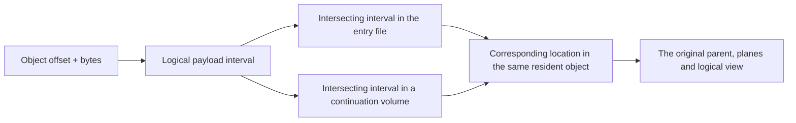

# Infernix v3 Container Specification

V3 stores a compact model instance config, the actual objects, logical bindings and the required
resources. The mathematical formulas, component handoffs and state programs are defined by model code.
A reader and a writer can independently implement the file organization and references from this
document alone; the binder of the corresponding architecture then interprets the logical parameters
and config.

An artifact has a fixed entry point and one overall directory. When small it is a single `.ninfer`
file; when large it consists of the entry file plus continuation volumes. Objects use one unified
logical payload offset, and file sharding preserves each object's encoding, layout and binding
relationships.

## 1. Contract and notation

| Content | Authority |
|---|---|
| File header, JSON, objects and references, file sharding, v3 persistent names | This document |
| Fixed mathematics, compact config, logical parameter shapes, component inputs | The corresponding architecture's [config](../../src/models/qwen3_5/config.h) and [binding](../../src/models/qwen3_5/load/) |
| Numerical decoding of a format, valid codes/scales | [Numeric formats](tensor-formats.md); persistent names in section 6 |
| A layout's planes, packing, internal padding and encoded size | [Storage layouts](storage-layouts.md); persistent names in section 6 |
| Native Op parameters, supported range, numerics and scratch | The corresponding Op contract |
| Residency, state, capacity, CUDA Graphs and result publication | [Engine architecture](engine-architecture.md) and its resource contracts |

All integers in this document are exact integers; booleans and floating-point values are interpreted
by their own types.

| Notation | Definition |
|---|---|
| U64 | An integer in `0..18446744073709551615` |
| PositiveU64 | A U64 strictly greater than zero |
| ID | A non-empty UTF-8 string without U+0000, compared exactly by its original character sequence |
| Shape | A list of `0..16` positive integers; the empty list `[]` denotes a scalar |
| `elements(shape)` | 1 for the empty shape, otherwise the product of the dimensions |
| `[begin,end)` | A half-open interval, closed on the left and open on the right |
| `align_up(x,a)` | `ceil_div(x,a)*a` |

Products, prefix sums, offset additions and alignment results must stay within the U64 range. Actual
I/O and memory consumers check their own address ranges. The file format uses 64-bit sizes; an Op's
actual shape support is determined by its call entry point.

Header integers are little-endian. JSON uses UTF-8, and member names are unique within each object.
Member order, ordinary string escapes and JSON whitespace keep their standard JSON meaning. Size fields
use JSON integers, and model real-valued parameters are stored and parsed with the precision their
contract requires.

The field tables list the complete member set and optionality of the generic records. An unlisted
generic field is a schema error; `config` is handed to the architecture to interpret, and `metadata`
and `provenance` are the open information objects defined in section 10.

## 2. File set and address space

### 2.1 Entry file and continuation volumes

The writer generates the file set from the specified entry output path. When the entry is
`example.ninfer`, the file names are uniformly:

```text
example.ninfer
example.ninfer.part-0001
example.ninfer.part-0002
```

The entry stores the header, the JSON overall directory and the first payload segment. Each continuation
volume stores its own small header and the following payload.
The writer names continuation volumes `<entry file name>.part-<index>`, where the entry file name
includes its original extension; the index equals that volume's index in the `files` table, starting at
1, written in decimal, left-padded with zeros to four digits when shorter than four digits, and written
in full when four digits or longer.
Continuation names are derived automatically by this rule, with no separate naming parameter; the
actual file name is written to `files[i].path`.

Users always open the entry file. The reader locates continuation volumes by the file names recorded in
the `files` table; the generation naming rule above is not a read validation condition, and any file
name in the directory that satisfies the path rules of section 3.3 can be read.

All files of one set share the same 16-byte `artifact_id`. It is used to check that the entry and the
continuation volumes belong together; writers are advised to use a new UUID each time they generate a
new file set. It is a container set identifier; model implementation selection still relies on the
architecture and instance parameters.
The header stores the raw 16 bytes; when printed it can be shown as 32 lowercase hexadecimal characters.

### 2.2 Logical payload

Let `files[i].payload_bytes = B_i`, and define:

```text
P_0 = 0
P_i = sum(B_j, j < i)
payload_bytes = sum(B_i)
```

File i stores `[P_i,P_i+B_i)` of the logical payload. These form an ordered set of contiguous intervals.
An object's `offset` is always relative to this logical payload; each file's header, JSON and the
alignment area before the payload are not counted in the logical payload.



An object can span file boundaries. It is still one object, and its format/layout is computed from the
logical start of the complete object.
A shard boundary can also fall inside a plane; reading and copying preserve the original byte order.

### 2.3 Default 32 GB shard limit

By default the writer uses a per-file size limit of **32 GB = 32,000,000,000 bytes**, counting the file
header, JSON, the alignment area before the payload and that file's payload. GB here is a decimal unit.

The writer can accept other explicit limits. The limit is a generation policy; the file stores only the
actual sharding result, and the reader reads by the directory.
If `entry_payload_start + payload_bytes <= limit`, the writer generates only the entry file.
Above the limit, the entry first holds the first segment, and the remaining data goes into continuation
volumes in order.

For a given entry_payload_start, the current writer's shard capacities are:

```text
entry_capacity = floor((limit - entry_payload_start) / 4096) * 4096
part_capacity  = floor((limit - 4096) / 4096) * 4096
```

When sharding is needed, the writer first checks that the limit can hold the headers and that both
capacities are positive; non-final segments are filled to capacity and the final segment holds the
remaining bytes.
The number of shards is determined by the data size and the capacities.
This placement keeps the logical start of every segment 4096-byte aligned, which suits direct I/O; the
reader's range mapping also accepts other positive-length segmentations that satisfy this
specification.

## 3. Binary framing

### 3.1 Entry header

The entry header is a fixed 32 bytes.

| Offset | Bytes | Field | Encoding and meaning |
|---:|---:|---|---|
| 0 | 8 | magic | `4e 49 4e 46 45 52 00 03`, i.e. `NINFER`, a zero byte, version 3 |
| 8 | 8 | json_bytes | Little-endian PositiveU64; length of the complete UTF-8 JSON text |
| 16 | 16 | artifact_id | Raw bytes of the file set identifier |

```text
json_offset         = 32
metadata_end        = 32 + json_bytes
entry_payload_start = align_up(metadata_end, 4096)
entry_file_bytes    = entry_payload_start + files[0].payload_bytes
```

The reader checks the complete magic, reads the JSON at `[32,metadata_end)`, and checks that the actual
file length equals entry_file_bytes. `[metadata_end,entry_payload_start)` is the file alignment area,
which the writer fills with zeros.

Legal trailing JSON whitespace counts toward json_bytes. The writer can use it to reserve a fixed amount
of directory space and then arrange the payload capacity in the entry file; this avoids repeatedly moving
the payload as the length of the shard table changes. The reader parses this text as standard JSON.

### 3.2 Continuation volume header

The continuation volume header is also 32 bytes, and the payload always starts at file offset 4096.

| Offset | Bytes | Field | Encoding and meaning |
|---:|---:|---|---|
| 0 | 8 | magic | `4e 49 4e 50 52 54 00 03`, i.e. `NINPRT`, a zero byte, version 3 |
| 8 | 8 | part_index | Little-endian PositiveU64; the corresponding index in the `files` array |
| 16 | 16 | artifact_id | Byte-for-byte identical to the entry file |

```text
part_payload_start = 4096
part_file_bytes    = 4096 + files[part_index].payload_bytes
```

The writer fills `[32,4096)` with zeros. When opening a continuation volume, the reader checks the magic,
part_index, artifact_id and actual length.
The entry file and continuation volumes have different magics; a continuation volume takes part in
reading through the entry file's directory.

### 3.3 File directory

The root field `files` is a non-empty array. Item 0 describes the entry file and the remaining items
describe continuation volumes.

| Field | Type | Meaning |
|---|---|---|
| path | null for item 0; a string otherwise | A sibling file name relative to the entry file's directory |
| payload_bytes | PositiveU64 | The number of logical payload bytes stored in that file |

```json
[
  {"path": null, "payload_bytes": 31999934464},
  {"path": "example.ninfer.part-0001", "payload_bytes": 4096}
]
```

A continuation path is a non-empty file name taken as its original character sequence; it contains no
`/`, `\\` or U+0000, and the name is not `.` or `..`. Continuation file names are distinct from one
another and differ from the name of the entry file being opened. The directory can be moved as a whole.

The numerical example above takes entry_payload_start=65536, so the entry file is exactly
32,000,000,000 bytes. The second file's actual size is 8192 bytes.

## 4. JSON overall directory

### 4.1 Root record

| Field | Type / required | Meaning |
|---|---|---|
| components | Object, required and containing text | The model components actually provided and their compact configs |
| objects | Non-empty Array<ObjectDescriptor>, required | Physical objects ordered by logical payload offset |
| bindings | Object, required | Mapping from complete logical parameter names to Bindings |
| uses | Array<Use>, required | Compute permissions and auxiliary inputs expanded per mathematical use site |
| files | Non-empty Array<File>, required | The file directory of section 3.3 |
| metadata | Object, optional | Information from section 10 such as the public name |
| provenance | Object, optional | Sources, training pairing and conversion notes |

The framing version already determines the JSON syntax, and the root record uses the fields above
directly. A complete JSON example is in section 12.

### 4.2 Component record

The keys of `components` are component IDs. `text` is the main model; the currently optional components
use `vision`, `mtp`, `dflash` and `dflash2`. New actual architectures or backends can use the same record
structure, with the corresponding compiled code interpreting their ID and config.

| Field | Type / required | Meaning |
|---|---|---|
| config | Object, required | The architecture identifier and this component's few instance parameters |
| target | Component ID, optional | The target component this component is associated with |
| resources | Object, optional | Mapping from resource roles to resource object IDs; omitted means an empty mapping |
| proposal | Object, optional, text only | The optional proposal output representation attached to the main model; see section 9.2 |

The config uses the corresponding architecture's standard architectures/model_type and the retained
fields.
For example, Qwen Text contains architectures, model_type, hidden_size and so on; Vision uses its own
standard model_type; the current Qwen MTP config needs only architectures, and its geometry is obtained
through target.
Source adaptation interprets the upstream `text_config`, `vision_config` and similar organization, then
writes the normalized result into the corresponding component's config; a component's target,
resources and proposal are placed separately as in this section's field table.

```json
{
  "config": {"architectures": ["Qwen3_5MTP"]},
  "target": "text"
}
```

A target reference must resolve to an existing component, and its mathematical association is checked
by the architecture binder. The target of the current Vision and spec components is text. The fixed
feature capture positions, state operations and feature preparation flow are defined by that
component's code.

Declaring a component means the artifact provides it. Startup options decide which components are
enabled for this run; text, the selected components and their actually shared data take part in
loading. The writer is responsible for the data integrity of the declared components, and the binder
checks the mathematical and data requirements of the features selected at startup.

## 5. Physical objects

### 5.1 Tensor object

| Field | Type | Meaning |
|---|---|---|
| id | ID | An object reference name unique within this artifact |
| kind | `tensor` | Object category |
| shape | Shape | The logical shape of the stored object, using C-order element coordinates |
| format | ID | The numeric format of section 6 |
| layout | ID | The layout of section 6 |
| offset | U64 | The byte offset of the object's start in the logical payload |
| bytes | PositiveU64 | The byte count of the object's complete encoding |

```json
{
  "id": "w.attn.qk",
  "kind": "tensor",
  "shape": [7168, 5120],
  "format": "q4_g64_fp16",
  "layout": "row_split_k128_v1",
  "offset": 0,
  "bytes": 19496960
}
```

The shape describes the object's logical value domain; the layout itself computes the physical padding,
planes and encoded size.
For example, Q4's K-dimension padding is computed by row_split_k128_v1. An object can hold multiple
projections or multiple experts, and its mathematical use is given by the bindings of section 7.

An encoded object contains all the planes and object-level scalars its codec/layout requires. The
existing NVFP4 block scales and weight divisor are inside the object; the row scales of the existing
per-row FP8 are also inside the object.
The separate pointers an Op needs are obtained from this object's defined layout. The activation divisor
of a use site is bound separately; see section 8.

### 5.2 Resource object

| Field | Type | Meaning |
|---|---|---|
| id | ID | Shares one unique namespace with all tensor/resource objects |
| kind | `resource` | Object category |
| encoding | `raw_bytes_v1` | The complete interval is raw resource bytes |
| offset | U64 | Byte offset in the logical payload |
| bytes | PositiveU64 | Raw resource length |

```json
{
  "id": "r.chat_template",
  "kind": "resource",
  "encoding": "raw_bytes_v1",
  "offset": 19496960,
  "bytes": 4096
}
```

How a resource is interpreted is determined by its use role. Content rules for JSON, UTF-8 templates or
other resources belong to the corresponding Frontend; the resource object itself only provides raw bytes.

### 5.3 Object ranges and sharing

All objects are ordered by increasing offset, IDs are unique, and byte intervals do not overlap and lie
within the logical payload.
A tensor offset satisfies the layout's 256-byte object alignment; a raw resource's alignment is 1.
Tensor bytes equal the encoded size of the corresponding `(format,layout,shape)`.

Gaps between objects and unreferenced logical payload bytes at the end have no load semantics. A regular
writer only leaves space for alignment and truncates at the end of the last object. Padding inside a
completely encoded object continues to follow its layout contract.

When multiple logical uses share the same object they all reference the same ID; the materializer
establishes the backing once on that basis.
Objects not referenced by the uses of this run stay non-resident. Object IDs, ordering and file
positions only take part in loading and diagnostics; the weight references used in execution are
resolved once by the binder.

A complete parent is the unit of materialization and residency. The converter must organize the trunk
parameters, the private parameters of each independently enableable component, and the private data of
independently selectable proposal representations into separate objects, so that the private data of a
disabled feature stays non-resident.
Truly shared data can be referenced by different features through the same object, for example Text and
MTP using the same embedding/head, or a proposal referencing an existing representation of the Text head.
Concatenating Text parameters and MTP private projections into the same parent violates this generation
rule; placing their independent objects in the same file complies with it. The converter checks object
merge boundaries against the architecture's feature dependencies, and the reader keeps reading by the
directory.

## 6. V3 numeric format and layout names

### 6.1 Numeric formats

V3 canonical names use lowercase snake_case. Each name refers to a codec in code with a precise meaning;
the fixed group size, scale type and decoding rules are defined directly by that codec.

| Name | Numerical meaning |
|---|---|
| bf16 | Raw Bfloat16 word |
| fp32 | Raw IEEE binary32 word |
| int32 | Signed 32-bit integer |
| q4_g64_fp16 | Signed 4-bit codes, G64, FP16 multiplier |
| q5_g64_fp16 | Signed 5-bit codes, G64, FP16 multiplier |
| q6_g64_fp16 | Signed 6-bit codes, G64, FP16 multiplier |
| q8_g32_fp16 | Codes `[-127,127]`, G32, FP16 multiplier |
| nvfp4 | E2M1 codes, G16 E4M3FN block scale, FP32 weight divisor |
| fp8_e4m3fn_row_bf16 | E4M3FN codes, one BF16 multiplier per row |

The FP16/BF16 at the end of a quantized name denotes the scale type. Activation compute permissions are
expressed in uses.
Code ranges, special floating-point values, rounding and exact reconstruction are interpreted per the
[numeric contract](tensor-formats.md).
In particular, NVFP4 reconstruction uses `code_value * block_scale / weight_divisor`, and per-row FP8 uses
its defined `code_value * row_scale` reconstruction rule.

When the encoder or calibration process changes for the same numerical meaning, the format name stays
the same, and the generation method is recorded in the recipe/provenance.

### 6.2 Layouts and resource encodings

| Name | Currently allowed format / shape | Object alignment |
|---|---|---:|
| contiguous_le_v1 | bf16/fp32/int32, rank 0..16 | 256 |
| row_split_k128_v1 | q4_g64_fp16, q5_g64_fp16, q6_g64_fp16, q8_g32_fp16, positive rank-2 `[N,K]` | 256 |
| block_scale_k16_m128x4_v1 | nvfp4, `N%128=0`, `K%64=0` | 256 |
| row_scale_v1 | fp8_e4m3fn_row_bf16, positive rank-2 `[N,K]` | 256 |
| raw_bytes_v1 | Resource, non-empty byte string | 1 |

Byte packing, planes, internal padding, swizzle and the encoded-size formulas are defined by the
[storage layout contract](storage-layouts.md).

A layout's v1 is the version of the layout itself and is managed separately from container v3. Adding a
different byte arrangement adds a corresponding layout definition; adding an actual numerical encoding
capability adds a codec definition, and ordinary object records keep using the same structure.

## 7. Logical parameter binding

### 7.1 Two kinds of Binding

The root `bindings` is a mapping from complete logical parameter names to Bindings. Names are defined by
architecture code, for example `text/layers/3/attention/query`. The logical parameter shape is derived
from code and the compact config.
Each logical name corresponds to one Binding. The architecture defines different logical names for
training parameter uses that need independent representations; each Binding can reference the same
object or different objects, and the training sharing relationship is defined by the architecture/config.

A Binding has two mutually exclusive forms:

| Form | Complete fields | Meaning |
|---|---|---|
| Whole object | `object: ID` | The whole tensor object corresponds to one logical parameter; object.shape equals the parameter shape |
| Ordered parts | `parts: non-empty Array<Part>` | The logical elements of each part are concatenated in order, covering the parameter's C-order element sequence |

The complete fields of a Part are:

| Field | Type | Meaning |
|---|---|---|
| object | Tensor object ID | The physical parent of the part |
| range | `[U64,U64]` | A flat interval `[begin,end)` of the object's logical elements |

Range satisfies `0<=begin<end<=elements(object.shape)`. The sum of the parts' element counts equals the
logical parameter's element count.
The array order is the target element order; the target offset is the accumulated length of the
preceding parts.
Intervals of the same object can be referenced by different uses or different parts; the actual meaning
of any repetition is interpreted by the corresponding model mathematics.

```json
{
  "text/final_norm": {"object": "w.final_norm"},
  "text/layers/3/attention/query": {
    "parts": [{"object": "w.attn.qk", "range": [0, 31457280]}]
  }
}
```

**The unit of a range is logical elements; the unit of object.offset/bytes is bytes.** The logical
element sequence excludes padding introduced by the layout and does not treat quantization scales as
weight elements. It keeps the parent's numerical decoding rule.

### 7.2 Axes, reshape and row order

C-order means the last dimension varies fastest. For shape `[N,K]`, element coordinate `(n,k)`
corresponds to `n*K+k`.
Contiguous complete rows `[r0,r1)` therefore correspond to the range `[r0*K,r1*K)`.

The whole-object form expresses a complete binding of the same shape. The ordered-parts form interprets
the target shape through an explicit element correspondence, and can express contiguous reshapes,
subregions of a fused parent, split objects and row-block reordering.
For example, one expert's interval in a rank-2 expert bank can correspond to a rank-2 logical
projection; higher-order logical axes are interpreted by that parameter's own shape.

If a parent interleaves two groups of projections, the converter can write a Part for each head's
contiguous region in turn.
Regular artifacts prefer preparing, at conversion time, the grouping and row order that existing Ops
consume easily.

### 7.3 Binding to native Ops

The binder checks logical coverage and correspondence, and keeps each Part's parent, original shape,
format/layout, range and owner. One logical parameter can consist of multiple representations; one
native Op can also consume multiple logical parameters.

For example, when Q/K and gate/V come from a q4 and a q5 parent respectively, parameter preparation can
enter the implemented two-weight entry point; when all four come from the same nvfp4 parent, it can enter
the corresponding single-weight entry point. Code organizes these calls from the real grouping, ranges
and geometry.

A zero-copy view is determined by the actual layout and the consumer's addressing capability. A run of
logical rows in RowSplit involves intervals in several planes such as base, optional high-bit and scale;
an NVFP4 view also keeps the original parent's scale swizzle and weight divisor. The materializer
uploads the parent's raw encoding, and the Op prepares the view it can really consume.
Work that changes packing or reorganizes the encoding is done by the converter.

File sharding only affects how parent bytes are obtained. Even if a parent spans multiple files, the
logical references and Op parameter relationships above still hold.

## 8. Use permissions and auxiliary inputs

The root `uses` is an array of Uses, with each `(parameter,input)` combination unique.
Each Use consumes the Binding its parameter points to; multiple Uses of the same parameter share that
representation and each provides the permission and auxiliary values at its own input position.

| Field | Type / required | Meaning |
|---|---|---|
| parameter | ID, required | An existing logical parameter name in the root bindings |
| input | ID, required | A complete mathematical input position defined by architecture code |
| activation_policy | Enum, optional | Required for uses that have this permission contract |
| auxiliaries | Object, optional | Mapping from auxiliary input roles to Bindings; omitted means empty |

The exact spellings of the permissions and their allowed sets are:

| activation_policy | Allowed set |
|---|---|
| A16Only | A16 |
| AllowA8 | A16, A8 |
| AllowA4 | A16, A8, A4 |

The writer writes an explicit result for every projection use site that needs a permission. An encoder's
default rule belongs to the recipe and is already expanded once it enters uses. When one activation
quantization is shared, the intersection of the related uses' permissions is taken, and the auxiliary
input relationships must be satisfied.

```json
{
  "parameter": "text/layers/3/attention/query",
  "input": "text/layers/3/mixer_input",
  "activation_policy": "AllowA4",
  "auxiliaries": {
    "activation_input_divisor": {"object": "a.attn.query.input_divisor"}
  }
}
```

The auxiliary object in this example is `format=fp32, layout=contiguous_le_v1, shape=[]`, and its value is
checked to be positive and finite as the consumer requires. A Part can also reference a single element of
an FP32 vector, keeping the same scalar meaning.
The expected shape, type and role of an auxiliary Binding are defined by the corresponding use contract.

DFlash/DFlash2 query K/V use `attention/key` and `attention/value`, and context K/V use
`attention/context_key` and `attention/context_value`, each with its own Binding and Use.
The two groups of bindings can share parent regions or choose representations independently; see section
12.5.
The weight divisor and block scales belong to the weight codec; the activation divisor belongs to the use
site.

## 9. Resources and optional output representations

### 9.1 Frontend resource references

The keys of a component's resources are interpreted by the corresponding Frontend contract; common
upstream file roles can use the original file names directly:

```json
{
  "tokenizer.json": "r.tokenizer",
  "tokenizer_config.json": "r.tokenizer_config",
  "chat_template.jinja": "r.chat_template",
  "generation_config.json": "r.generation_config"
}
```

All these values reference resource objects. They are object references, and the actual resource bytes
are stored with the artifact.
Vision's processor resources can be placed in vision.resources and are obtained by dependency when the
feature is enabled.

V3 can carry a custom chat template in the corresponding resource object. The resource stores raw bytes,
and recognition and rendering of the template are determined by the actual capabilities of the current
[Frontend](../../src/models/qwen3_5/frontend/chat_template.cpp).
The complete tokenizer resources together determine the token domain, and the fixed model config keeps
its own weight vocab_size.

### 9.2 Optional proposal output representation

The complete record of `text.proposal` is:

| Field | Type / condition | Meaning |
|---|---|---|
| domain | `full` or `indexed` | Proposal row domain |
| rows | PositiveU64, indexed only | Ns; the logical row count of the indexed head |

Its parameters still live in the root bindings, using the defined names `proposal/head` and
`proposal/token_ids`.
Full takes its row count from the Text vocab_size; indexed needs an explicit token ID mapping. The main
output head is always provided by Text's own bindings. When proposal is omitted, the existing backends
use the target's complete output representation according to their code.

## 10. Instance information and provenance

`metadata` is an open JSON object; the optional `name` is a non-empty public name string, and the other
members are for display and tool records.
`provenance` is an open JSON object that can store the source checkpoint/revision, component training
pairing, encoder/recipe notes and conversion information. Both are treated as empty objects when omitted.

The numerics, permissions and resources needed for execution go into config, objects, bindings, uses and
resources respectively.
The Frontend reads EOS from generation_config; mode sampling presets are provided by the architecture
implementation and can be overridden by the application and the request.
Sampling values in the resources are stored as is, and the current Frontend does not use them to replace
the mode presets; see the [CLI sampling notes](../cli.md).
Provenance describes where a training pairing came from; the binder checks the component's actual
target, dimensions and input relationships; quality and acceptance rate are established by artifact
evaluation.

The artifact_id is used to check the shard set, the public name for product semantics, the
architecture/config to obtain the fixed model implementation, and the object bindings to provide the
actual representation. Each consumer reads the data for these purposes.

## 11. Reading, writing and error boundaries

### 11.1 Generic reader

The reader first reads the entry header and JSON, and completes the following structural checks:

1. Framing, field sets, types, unique members and integer ranges.
2. The order, paths, positive lengths and logical prefix sums of files; the actual length of the entry
   file.
3. Object IDs, shapes, byte ranges, ordering and non-overlap.
4. Binding/Use/resource/target references exist, the referenced object categories are correct, and Part
   ranges are legal.

The reader can keep not-yet-interpreted architecture configs and format/layout names for inspection.
When a tensor needs to be read, the generic codec/layout facilities parse its format and check the
encoded size and alignment; selected resources are read by their encoding. Unknown encodings are reported
when an actual request interprets that object.

A complete distribution contains every file the directory declares. One run opens only the files that
the selected objects involve; the other continuation volumes can stay unfetched.
If any needed segment is missing, a header belongs to another set, or a length does not match, the
related read fails.
When a component is disabled, the read range is decided by the selected requirements, and other objects
in the same file stay unuploaded.

### 11.2 Range reads and materialization

For a logical read `[offset,offset+length)`, take its intersection with each file's payload interval in
turn.
The read range must lie entirely within `[0,payload_bytes)`; when length=0, offset may be at the end and an
empty result is returned.
A range read must obtain all declared bytes; a premature EOF or an I/O failure inside the declared
interval is handled as a read error.
If the intersection is `[a,b)`, the corresponding read is:

```text
source_file_offset = file_payload_start(i) + (a - P_i)
destination_offset = a - offset
copy_bytes          = b - a
```

The I/O layer can further split these segments into transfer blocks and write them at their original
offsets into the same target object. File headers and file alignment areas do not take part in copying;
cross-file data is handed to the materializer through the range mapping above.

The materializer deduplicates by the parents actually used, arranges device/host backing, and then
obtains typed views.
Uses that need owning Host values, such as auxiliary scalars and indices, can read the corresponding
element interval by Binding, keeping its numeric type.
The reader's JSON and symbol index are for cold loading; at runtime the resolved references and direct
calls are used.

### 11.3 Semantic and support checks

| Situation | Owner |
|---|---|
| Header, directory, reference and range errors | Generic reader |
| Format/layout encoding geometry, missing or mismatched actual files | Object reading and materialization |
| Compact config, logical parameter shape/coverage, component relationships, missing data for selected features | The corresponding architecture binder |
| Correctness of codes/scales, encoding padding and source numerical conversion | Converter, codec and the corresponding verification |
| Insufficient support for actual native parameters, format/layout/shape/phase | Op preparation, capacity queries, warmup or execution |
| State storage, actual capacity and lifecycle | Program and the state implementation |

The runtime completes the necessary checks along the actual consumers and uses the converted payload;
regular upload relies on the codes/scales contract the producer established. Numerical qualification
follows the existing Op/codec rules.
Warmup conclusions cover the actual execution path, and a failed round is handled by the existing state
transaction.

### 11.4 Writer

The writer receives the already-determined component configs, object/binding/use descriptions and the
actual conversion jobs:

1. Receive the objects the converter organized by the feature dependencies of section 5.3, obtain each
   encoded size from its codec/layout, and arrange object alignment and order in the logical payload.
2. Store the components, bindings, uses and resource references the converter provides, and check the
   generic directory structure and reference relationships.
3. Choose the limit and the JSON reserved space, generate continuation names per section 2.1 and compute
   the files table so that each file's final size meets the generation limit.
4. Serialize the JSON; if it exceeds the reserved space, enlarge the space and recompute the shard table
   before writing starts.
5. Generate the artifact_id and write the entry and continuation headers.
6. Stream the conversion results to their logical payload positions; objects that span files continue to
   be written in the same byte order.
7. Check complete coverage of the declared intervals and the actual file lengths, publish the
   continuation volumes first, then publish the entry file.

The current writer generates into temporary files, cleans up this run's files on failure, and does not
overwrite an existing target.
The writer can use trailing JSON whitespace to keep the reserved json_bytes stable. The reservation
policy and transfer block size are implementation details; the reader only uses the actual framing and
files values. When the shard limit changes, the same logical payload can be copied, keeping the object,
binding and use records, to generate a new files table and file set identifier.

## 12. Concrete examples

### 12.1 Complete Text-only directory

The [single-file example](examples/artifact-v3-text.json) contains a complete small Qwen3.5 Dense Text
config, all logical parameters of one attention layer and FFN, the four Text Frontend resources and all
projection use records.
The config and model parameter geometry are for specification validation; it is a synthetic instance,
and whether the current Ops can execute that size is judged separately.

The example uses H=128, I=256, Nq=Nkv=1, D=128, L=1, R=248320, and all weight objects use bf16.
Q/K/gate/V are stored in one `[512,128]` parent, and FFN gate/up in one `[512,128]` parent.
Norm, embedding, the main head, attention output and FFN down are each bound to their own object.

The lengths of the four resources are taken from locally verified Qwen3.8 Text resources. The example
JSON provides the complete directory; the resource and weight payloads themselves are not attached to the
documentation. Encoding this directory takes json_bytes=65504, with legal whitespace appended after the
actual JSON, giving entry_payload_start=65536. The example is generated as a single file under the default
32 GB limit.

### 12.2 Mixed formats and file sharding of the same model

The [mixed-format sharded example](examples/artifact-v3-mixed-sharded.json) reuses the config, resource
roles and logical parameters above.
Attention changes to a q4 Q/K parent and a q5 gate/V parent; uses still use A16Only.
The example explicitly sets the file limit to 64,000,000 bytes to demonstrate sharding; the production
default is still 32 GB.

The entry payload_start is likewise 65536, and the continuation's is 4096. Objects such as Embedding span
the file boundary; their object shape and format/layout stay complete. The differences between the two
examples fall in the object representations, the Part references and the files table respectively.

### 12.3 Single-parent and two-parent Attention

Taking the actual 27B's H=5120, Q=6144, K=1024, the ranges below are all logical elements:

| Logical parameter | Two parents: Q4 A + Q5 B | Single parent: FP8 or NVFP4 P |
|---|---|---|
| Query | A `[0,31457280)` | P `[0,31457280)` |
| Key | A `[31457280,36700160)` | P `[31457280,36700160)` |
| Gate | B `[0,31457280)` | P `[36700160,68157440)` |
| Value | B `[31457280,36700160)` | P `[68157440,73400320)` |

The shape of A/B is `[7168,5120]` each, and P is `[14336,5120]`. Their complete encoded sizes are:

| Object | Format / layout | Bytes |
|---|---|---:|
| A | q4_g64_fp16 / row_split_k128_v1 | 19,496,960 |
| B | q5_g64_fp16 / row_split_k128_v1 | 24,084,480 |
| P | fp8_e4m3fn_row_bf16 / row_scale_v1 | 73,428,992 |
| Another representation of P | nvfp4 / block_scale_k16_m128x4_v1 | 41,287,684 |

The binder obtains the same four logical parameters, and actual Op preparation sees one or two parents.
NVFP4's activation auxiliary values are associated with the corresponding use sites per section 8. If P
spans two files, it still provides the same physical parent.

### 12.4 Row-block reordering, reshape and sharing

Suppose a bf16 parent has shape `[8,4]` and stores Q0, gate0, Q1, gate1 in turn, two rows each.
Query `[4,4]` and gate `[4,4]` can be expressed respectively as:

```json
{
  "query": {
    "parts": [
      {"object": "interleaved", "range": [0, 8]},
      {"object": "interleaved", "range": [16, 24]}
    ]
  },
  "gate": {
    "parts": [
      {"object": "interleaved", "range": [8, 16]},
      {"object": "interleaved", "range": [24, 32]}
    ]
  }
}
```

A `[4,4]` object can also use a single Part `[0,16)` to correspond to a logical `[2,2,4]`, expressing an
explicit C-order reshape.
Consumption of the actual view still depends on that object's layout and the Op's addressing capability.
A tied embedding/head can use the same whole-object Binding under two logical names; their Uses are
described separately.

### 12.5 Different uses of the same training parameter

Take layer 0 of DFlash2, with Hd=5120, Qd=4096, Kd=1024. Below are the two uses of K:
query uses the K region in `w.draft.qkv [6144,5120]`, and context uses the independent
`w.draft.context_key [1024,5120]`. Both can use q8_g32_fp16 / row_split_k128_v1.

```json
{
  "bindings": {
    "dflash2/layers/0/attention/key": {
      "parts": [{"object": "w.draft.qkv", "range": [20971520, 26214400]}]
    },
    "dflash2/layers/0/attention/context_key": {
      "object": "w.draft.context_key"
    }
  },
  "uses": [
    {
      "parameter": "dflash2/layers/0/attention/key",
      "input": "dflash2/layers/0/query_projection_input",
      "activation_policy": "AllowA8"
    },
    {
      "parameter": "dflash2/layers/0/attention/context_key",
      "input": "dflash2/context_input",
      "activation_policy": "AllowA8"
    }
  ]
}
```

Source adaptation hands the same trained K parameter to these two logical roles, and the recipe can
generate their representations separately. Fixed query execution consumes key, context materialization
consumes context_key, and Op parameter preparation obtains the corresponding parent/view for each.
To choose a shared representation, change context_key's Binding to the same Part as key and drop the
independent object; the two Uses still keep their own permissions and auxiliary inputs.
Value/context_value follow the same rule.

### 12.6 Parameter integrity and encoding failures

| Input | Result |
|---|---|
| The same object ID appears twice | Directory error |
| The byte ranges of two physical objects overlap | Range error; sharing is expressed by referencing the same object |
| A Part end exceeds the source object's logical element count | Reference error |
| The total value length of the Parts does not match the required parameter | The binder reports a parameter coverage error |
| An object uses an unimplemented format/layout | Fails when a request interprets that object's encoding |
| A scalar activation divisor references a non-scalar / unexpected numeric representation | Binding error for that use |
| The second continuation volume a required parent spans is missing | Range read fails |
| A continuation volume with the same index from another artifact is supplied | artifact_id mismatch |
| Enabling a Vision/spec component the file does not provide | Selected component missing |
| Metadata and representation are legal, but the native Op lacks the corresponding grouping or shape entry point | Actual Op preparation, warmup or call fails |
