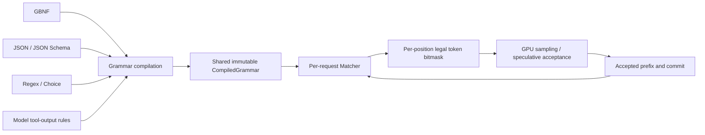
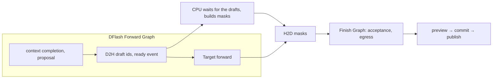

# Constrained decoding design

This document defines the architecture, functional semantics and execution contract of Infernix's
constrained decoding. GBNF, JSON object, JSON Schema, choice, regex and tool constraints are
implemented across ordinary decoding, MTP, DFlash and DFlash2 (Qwen3.5) and ordinary decoding, MTP
and n-gram copy drafting (Qwen3.8-Flash-Next). Content constraints are used through
`RequestOptions::constraint`, the CLI and the three HTTP protocols; tool declarations belong to the
Prompt and the call policy to `RequestOptions::tool_choice`.

The goal is one token-constraint mechanism shared by GBNF, JSON, JSON Schema and tool calls, plugged
into the existing ordinary sampling, MTP, DFlash, DFlash2, thinking, streaming output and
preemption/recovery. Infernix keeps one GPU, fixed resident lanes and native C++/CUDA execution.

Overall choices: vendor XGrammar's CPU core; the Frontend builds grammars that match the model's
output semantics; the request owns the matcher; the Program manages the bitmask buffers and the
execution timing; the Sampling Ops build the target distribution over the legal set. Model state,
grammar state and user-visible output advance along one commit boundary.

## 1. Function and semantics

### 1.1 One underlying mechanism, several constraint entries



GBNF is the direct grammar input and the smallest complete use of the mechanism. JSON Schema and tool
rules compile to the same runtime objects; the sampling ops do not branch on JSON, GBNF or tool type.

A constraint controls the legal set of the next token. A candidate token's complete bytes must be
acceptable from the current grammar state; a token may span several punctuation marks, rules or output
phases, and may contain only part of a UTF-8 sequence.

A constrained output that completes normally belongs to the declared language or schema subset. A
length limit, context exhaustion or cancellation may leave an incomplete result. Structural conformance
and factual correctness are different properties.

### 1.2 Scope of a constraint

| Request form | Constrained object | Initialization point |
|---|---|---|
| JSON, schema, GBNF, regex, choice for a new Chat reply | the final content | the start of this turn's new content; thinking is carried by the model's outer rules |
| Direct grammar for a raw token/text continuation | all new text | after the prompt; the prompt is not taken as a grammar prefix |
| ContinueFinalAssistant | the existing last assistant content joined to the new suffix | the matcher is initialized with the existing content |
| Tool constraints | the model's native tool framing, the call policy and argument values | the start of this assistant output, including allowed thinking/content |

Constraints belong to Generation requests; ordinary CausalScoring does not use this path. Vision only
affects how the prompt is built; the output constraint is the same afterwards.

### 1.3 Completeness and sampling semantics

Three facts are recorded separately:

- the current token prefix can still continue under the grammar;
- the current content is in a state that may end;
- whether the request ended as a normal constrained completion.

For example `root ::= [0-9]+` may end after generating `1` and may still continue with digits. "May
end" is not "must end now".

Constrained decoding defines a new per-token distribution. It is not the original model's global
distribution conditioned on the whole output satisfying the grammar. Speculative decoding preserves the
same per-token target distribution as ordinary constrained sampling.

## 2. Source and module boundaries

### 2.1 Vendored XGrammar

The source lives in `third_party/xgrammar/` and is maintained like `third_party/llama-jinja/`: a fixed
source version, its provenance and licence kept, the needed changes maintained by Infernix and upstream
changes taken as needed.

It starts from the CPU core and its dependencies: grammar parsing and compilation, JSON Schema/regex
conversion, vocabulary indexing, the matcher, bitmasks and rollback, keeping the recursion, Unicode and
token-level rule features GBNF needs. Python/TVM bindings, upstream CUDA/Triton integration, examples
and unrelated build branches do not enter the product target.

The product build uses an explicit source list and its own CMake target. Small dependencies the core
needs (picojson, DLPack) are managed inside that boundary; DLPack only adapts the library's CPU tensor
views and does not enter Infernix's public API or the CUDA Op contracts.

Direct customization is allowed for:

- returning structured errors for assertions the compiler cannot execute, instead of a warning and
  looser semantics;
- caller-owned bitmask views, fewer intermediate allocations and format conversions;
- exposing what reliable mark/rollback/preview needs;
- vocabulary handling, temporary state and compile caching tuned for real workloads.

Trimming keeps the complete dependencies of the chosen CPU features. The library's internal types need
not become Infernix's public contract.

### 2.2 Responsibilities

| Owner | Responsible for |
|---|---|
| Third-party CPU core | grammar, tokenizer-aware compilation, matcher, legal sets and rollback |
| Infernix public request contract | user constraint types, content constraints, tool choice and strict intent; no third-party types |
| Generic text-constraint adapter | schema validation and composition reduction, source locations, shared compiled resources, CPU bitmasks and temporary matcher operations |
| Model Frontend | raw vocabulary and control tokens; thinking/content/tool framing; continuation prefixes; tool value representation |
| Request OutputSession | the mutable matcher, output parsing, preview and commit |
| Engine | request lifecycle, the round's request/row mapping, the call-scoped mask service, batch commit and result publication |
| Program | device/pinned buffers, per-position data layout, fixed execution composition, CUDA Graphs and physical state commit |
| Sampling / speculative Ops | legal-candidate filtering, probability normalization, p/q acceptance, residuals and sampling results |
| Gateway / CLI | file acquisition, protocol field translation, protocol errors and response encoding |

The generic adapter lives in `src/text/`; Qwen output semantics in `src/models/qwen3_5/frontend/`. The
execution data contract belongs to `src/runtime/contract/`; the physical consumers are owned by the
Programs and Ops.

## 3. Request input and compilation

### 3.1 Request representation

A public request owns an optional content constraint, one of:

- a JSON object;
- a JSON Schema document;
- GBNF text with entry rule `root`;
- a regex;
- a finite set of string choices.

It is `OutputConstraint` in `RequestOptions::constraint`, an enum of Grammar, JsonObject, JsonSchema,
Choice and Regex owning the source text or literal list. The runtime reads no files: the CLI reads
grammar/schema files while preparing input, and HTTP converts field contents into request data.

Tool constraints come from the owning tool definitions and tool policy: each tool's name, argument
schema and strict flag, and auto/none/required/named with whether several calls are allowed. They come
from the same request facts the template receives; execution never re-extracts schemas from rendered
prompt text.

`prepare(PromptInput)` and `submit(PreparedPrompt, RequestOptions)` keep their split. The PreparedPrompt
holds the parsed tool definitions, the starting output phase and any continuation prefix; at submit the
tool policy and content constraint combine with these facts to build the OutputSession, which holds
the CompiledGrammar and the matcher. Ordinary `count_tokens` does not compile output constraints.

JSON object / JSON Schema may be combined with an active tool set. Auto's output language is the union
of JSON content and a complete tool sequence; Required / named allow only the tool sequence this turn;
None allows only content. GBNF, choice and regex combined with an active tool set are rejected while
preparing.

### 3.2 Preparation

```text
protocol/CLI translate the owning request
  → prepare: the Frontend renders the prompt, fixes the output phase and continuation prefix
  → submit: take an outstanding slot, prepare the OutputSession on the calling thread
  → validate the constraint type and feature combination; look up the cache by source and model framing
  → on a miss validate the schema, convert and compile the immutable grammar
  → create and initialize the request matcher
  → join the existing waiting queue
```

Compilation happens at the existing `make_output_session` preparation boundary on the calling thread,
outside the Engine worker, without holding the queue/execution mutex. It occupies an outstanding slot,
released on failure. Cold compile latency counts as request preparation; a cache hit reuses the grammar
with a new matcher. Strict tools' argument-representation analysis is request preparation and uses the
same schema reduction as the grammar.

submit still builds the request synchronously and returns a handle; a cold compile may lengthen the
call. The pending deadline is not moved by compilation: after the library call returns and before
queueing, the deadline and Engine state are checked again. Cancelling generation uses the existing
handle/consumer path; there is no scheduler for preemptible compile tasks.

The initial mask may be checked and cached while preparing. A generation request with no legal token at
its initial position returns a request error. An empty set on a temporary speculative branch later does
not fail the whole request in advance (section 7).

### 3.3 Vocabulary adaptation

The adapter uses the Frontend's parsed raw bytes `decoded_token(id)` and valid/special flags, so the
token domain matches the sampling ops. The vocabulary is adapted once:

- no display-level decode, no replacement of incomplete UTF-8, no NFC renormalization;
- padding, invalid ids and vision-only tokens that cannot be generated are not ordinary text candidates;
- ordinary text tokens match by their bytes;
- EOS is a completion control; thinking and other required special tokens are allowed only in the
  corresponding model rules;
- an ordinary token spelling and a special token with the same visible string are handled separately.

Infernix supplies these classes explicitly; upstream `TokenizerInfo`'s default special-token guess does
not replace the Frontend's facts. The adapter may pass explicit classes through the vendor interface;
it does not infer semantics by treating every control token as an ordinary string.

### 3.4 Compile sharing and memory

Each Frontend holds a compiler/cache bound to its vocabulary. A CompiledGrammar is immutable and the
OutputSession holds a shared reference.

The constraint vocabulary index and compiler initialize thread-safely on first constrained use; that
time belongs to that prepare. The ordinary tokenizer keeps its initialization. Requests without
constraints trigger no extra CPU indexing.

The cache key combines the constraint kind and source, the compile options and the model's output
framing. Different starting content phases can produce different framings; a continuation's concrete
content prefix only advances a new matcher and is not part of the compiled grammar's identity.
Different vocabularies use different compiler instances.

JSON sources are parsed and serialized order-preserving; the declared property order is part of the
generated layout and is not reordered to raise the hit rate. A regex keys on its source text and
compile options.

One thread-safe compile cache from the library is reused. Concurrent cold compiles of the same key share
one build; the cache lock does not cover the whole compile of different keys. Each model runs at most
two cold compiles at once, each on its submit thread and single-threaded inside; cache hits take no cold
slot. GBNF, JSON object, JSON Schema and regex key on kind, source text and model framing; choice uses
the normalized literal set. Validation, conversion, framing and vocabulary compilation happen inside the
same bounded build on a miss; a hit does not parse or convert again. Continuation bytes only initialize
the matcher.

The default compile-cache budget is 256 MiB, the Engine startup option `grammar_cache_bytes`. It bounds
the compiled results the cache keeps; objects still used by requests outlive eviction, so it is not a
hard bound on process RAM. The vocabulary index, active matchers and compile scratch are counted
separately and not charged to the KV/GDN host cache quota.

## 4. GBNF, JSON Schema and functional semantics

### 4.1 GBNF / regex / choice

GBNF uses the EBNF/GBNF text syntax of the vendored version, entry `root`, with literals, character
classes, sequences, alternatives, repetition and recursion. Syntax errors carry line and column.

The first public grammar contract is the language constraint itself. Library extensions that would
change temperature, add a token budget or otherwise change generation are not implicit run parameters;
those stay under Infernix's sampling and budget contracts. Token-level terminals are checked against
the model's token domain and control-token rules.

Token terminals use the vendor's `Token(id, ...)` / `ExcludeToken(id, ...)` forms. The GBNF entry does
not expose upstream's `TagDispatch`, `TokenTagDispatch`, `Regex` or `Substring` constructors. XGrammar's
`(= ...)` lookahead annotation is kept to describe a rule's legal suffix and help compile token masks;
the language is defined by the rule bodies, and the annotation must agree with them (upstream's
compile-hint semantics, not an independent regex lookahead). A user's direct grammar may reference
ordinary generable tokens; EOS and reserved model control tokens belong to the outer completion/phase
rules and are not visible content terminals. Model framing may use the exact ids of its control tokens.

Choice is built as literal grammar alternatives that keep case, whitespace and Unicode exactly, with
multi-token options and shared prefixes. The list must not be empty; the empty string is allowed,
duplicates are removed and order carries no weight. When a short choice is a prefix of a longer one,
matching the short one allows both EOS and continuing. The public interface is
`OutputConstraint::choice(vector<string>)`.

A regex matches the whole content, `OutputConstraint::regex(string)`; an empty expression allows only
empty content. Literals, Unicode characters, classes, groups, alternatives and `*`, `+`, `?`, `{m,n}`
repetition are supported. Greedy and lazy forms describe the same legal set; no captures are returned.
Classes follow ECMAScript: `\d`/`\w` are ASCII, `\s` includes Unicode whitespace, `.` excludes `\n`,
`\r`, U+2028 and U+2029. Escapes such as `\xNN` and `\uNNNN` are supported; characters outside the BMP
are written directly. Output contains only Unicode scalar values.

`^`/`$` are accepted only at the ends of the expression or of top-level alternatives; elsewhere, and
back-references, lookaround, word boundaries, Unicode property classes, flags, surrogate escapes and
unknown escapes, return request errors. `regex_converter` shares character and escape normalization:
the regex entry matches the whole content while JSON Schema `pattern` keeps search semantics. Invalid
choices or expressions use `InvalidChoice` / `InvalidRegex`; a generation prefix that cannot continue
uses `ConstraintDeadEnd`.

Both share the compile cache and matcher. A choice's cache identity is the deduplicated literal set,
independent of tokenization; whole-match and JSON Schema search use different entry identities. Runtime,
sampling and speculative backends consume the same mask contract.

A raw grammar is not injected into the prompt: the constraint owns the candidate space and the user's
prompt owns the task and field meanings.

### 4.2 The JSON and schema execution contract

`json_object` compiles to the root-object language, not an arbitrary JSON scalar. `json_schema` uses
the root type the user gives explicitly: object, array or another supported type.

`src/text/json_schema.cpp` validates the source schema and `schema_composition.cpp` reduces the
supported compositions to a compilable schema graph, keeping source positions. The vendored library
owns string automata, the JSON / Qwen argument representations and grammar construction. Supported:

| Category | Semantics |
|---|---|
| Basic types | object, array, string, integer, number, boolean, null; a type array expands per branch with the assertions that apply to it |
| Objects | properties, required, additionalProperties (boolean or subschema); required names must be declared in properties; declared fields generate in a fixed order |
| Arrays | homogeneous items or positional prefixItems, trailing items, minItems/maxItems; draft-07 item arrays and additionalItems reduce to the same positional contract |
| Strings | minLength/maxLength together with pattern, several patterns intersected; format is not supported yet |
| Numbers | integer and number with minimum/maximum/exclusive bounds; integer ranges reduce to signed 64-bit, bounds may fold from decimals; a bounded number uses int64 integers and finite binary64 text of at most 17 significant digits; multipleOf is not supported yet |
| Finite values | const, enum; integer literals limited to signed 64-bit; candidates filtered by the supported sibling assertions, including type, range, string, object/array and logical compositions |
| Composition | anyOf distributes common assertions and takes the union; oneOf must prove its branches exclusive; allOf intersects types, ranges, strings, object fields/required/additionalProperties, arrays per position and tail rule, and local references |
| References | in-document `$ref`, `$defs`/definitions, including recursion and 2020-12 sibling assertions next to a reference; external documents are never fetched |
| Annotations | title, description, default, examples, `$comment`, readOnly/writeOnly, deprecated and similar stay descriptive and are not sampling assertions |

Checks walk only schema positions; business objects inside const/enum stay values. Composition
reduction memoizes per node and intersection, and recursion stays a reference graph. Object
intersection applies properties and additionalProperties per branch: one branch's closed object cannot
be reopened by properties another adds. If merged required makes a field impossible, the whole object
branch is unsatisfiable.

prefixItems constrains only positions that occur; length comes from minItems/maxItems, and items applies
after the prefix of the same schema object. Where a position is false or an intersection is
unsatisfiable, the array may end before it; only when the minimum length crosses that position is the
branch unsatisfiable. Per-position intersection keeps each branch's own prefix length and tail rule.

A bounded number constrains both the generated decimal value and the value after protocol parsing and
re-serialization. The compiler compares ranges by decimal digits and exponent and tightens the floating
generation language at the rounding boundaries of publishable binary64 values; integers keep an exact
int64 path. Decimals allow scientific notation and, for common magnitudes, plain decimals, with at most
17 significant digits. A mathematically empty range is unsatisfiable; a non-empty range with no
publishable value is unsupported. Numeric assertions or const/enum values that JSON parsing would round
are rejected when the source is read; annotation fields and non-strict tools are not so restricted.

After merging common assertions, oneOf proves exclusivity by type domains, finite value sets or the
finite values of a common required discriminator; integer is a subdomain of number. A composition that
cannot be proved is unsupported.

An empty schema means any JSON value. Without `$schema` the semantics are 2020-12, and the supported
subset of explicit draft-07 is accepted. Draft-07 sibling assertions next to `$ref` are unsupported (use
allOf for an explicit intersection). A root `$id` is only the document identity; nested `$id` is
rejected. A boolean subschema is read by its position, for example additionalProperties=false.

Specific rules:

- Standard defaults follow the schema: a missing additionalProperties is not turned into false because
  of the library's internal strict_mode. The protocol's `strict` and the library's option of the same
  name are separate.
- A `oneOf` whose exclusivity cannot be enforced is rejected, not weakened to anyOf.
- XML excludes and schema pattern/length must hold together; an intersection that cannot compile is
  unsupported.
- Conditionals/dependencies, uniqueItems, contains, multipleOf, patternProperties/propertyNames,
  minProperties/maxProperties, unevaluated* and other assertions outside this contract are rejected
  explicitly.
- Unrecognized assertion keywords and compositions that would be ignored return an error located by
  JSON Pointer. There is no "compiled but only warned" relaxation.
- The `any_order` option, which would lose required/duplicate-key semantics, is not enabled. The
  generation language may use a fixed property order; output values must still satisfy the schema.

`pattern` matches string values with schema (search) semantics, not the whole-content regex entry.
Length counts decoded Unicode characters, independent of escaping; control characters, quotes and
backslashes in JSON strings must be escaped legally. Finite const/enum candidates that filter to empty
and recursive definitions with no generating branch are unsatisfiable at compilation or the initial
mask check, rather than having the constraint dropped.

JSON uses compact `,` / `:` separators and the declared field order. String length and pattern grammars
use canonical JSON escapes; a continuation must be a prefix of this generation language. `pattern`
searches the string value with classes, groups, alternatives, repetition and `^` / `$` at the ends of
top-level alternatives. Dot and whitespace classes follow ECMAScript; back-references, zero-width
assertions, Unicode property classes, surrogate escapes and unknown escapes are unsupported, and
Unicode characters may be written directly.

Composition compilation has explicit limits: at most 16384 intersection merges per reduction, finite
value recursion depth at most 256, explicit string-automaton intersection length bounds at most 8192
Unicode characters and at most 65536 states per intersection result. Beyond them the schema is
unsupported. Finite enumerations filter directly and plain length constraints keep their own paths
without building string intersection automata.

These rules are the contract shared by response schemas and strict tool arguments. The supported range
may grow later; each extension brings its semantics and independent verification, without changing the
runtime structure.

### 4.3 Tool constraints

Tool constraints are three independent choices: the base structure (framing, names), per-tool strict
argument schemas, and the call choice and count. `ToolChoice` owns Auto/None/Required, optional
allowed_names, parallel and Automatic/Basic; the three HTTP protocols map their fields to this contract.

The default Basic enables structural constraints for requests with tools, including ordinary Auto with
non-strict tools: the model chooses content or a tool call, and once in a call the function name and
framing are constrained. Explicit Automatic enforces only what the request asks for (strict,
allowed_names, Required, None or parallel=false); ordinary Auto with non-strict tools generates freely.

The non-strict base argument language allows any order and any representable argument name; it does
not close the argument set from properties or enforce required or value assertions. Complex root
schemas and open objects do not trigger the strict compiler. Argument values keep the existing
normalization hints; a repeated argument takes the last value and keeps the first occurrence's
position, so each key appears once in the published object. Strict arguments generate in declared order
and forbid repeats.

Auto allows zero or more calls; Required at least one; parallel=false limits it to one. OpenAI named
maps to Required with one name and parallel=false; Anthropic named uses one name and honours
disable_parallel_tool_use. None keeps the prompt's declarations and forbids generating `<tool_call>`;
combined with a content constraint, the content constraint owns the output language. Every choice keeps
the full declarations and cache-marker positions; none is implemented by editing the prompt's tool list.

Under Auto, ordinary content may precede the tool sequence; Required starts with a call. Once in the
call sequence only further calls and EOS are allowed, separated by single newlines. Every strict tool's
final `arguments_json` satisfies its argument schema.

When JSON output is also requested, Auto chooses between JSON content and a tool sequence and does not
mix them in one turn; even with `constraints=Automatic` the tool branch keeps base framing constraints.
Required / named generate calls this turn; after the tool results the next turn may use Auto to produce
the JSON. Every turn still validates against the given JSON schema.

A combination builds one CompiledGrammar and matcher, with the thinking framing outside the union. The
OutputSession chooses the publication branch at the first committed content character: JSON's first
characters and `<tool_call>` do not intersect. The JSON branch bypasses tool parsing, so `<tool_call>`
inside a string stays as written. Preview/discard does not change the branch; a continuation
initializes from its existing content prefix.

Qwen's tool syntax uses the existing `<tool_call>`, `<function=...>`, `<parameter=...>` form. The
Frontend builds two products from the same parsed tool definitions, the generation grammar and the
output value-decoding contract, so the two never interpret types separately.

Strict arguments use explicit physical framing. A string argument, escaped:

```text
<parameter=city>\nShanghai\n</parameter>
```

The two `\n` are the framing newlines. Decoding strips only that pair; the string's own leading and
trailing whitespace is kept. Numbers, booleans, objects and arrays use legal JSON value text; nested
values stay schema-constrained.

The choice between a Qwen raw string and a JSON value must be unambiguous. Pure string arguments use a
raw string; type unions without string use JSON values. A raw argument mixing string with other types
whose branch the model format cannot determine is rejected for strict composition while preparing; the
existing "any argument that allows string is read as string" cannot be claimed to enforce the other
branches.

A raw string argument ends at `\n</parameter>`, which must not occur in the value. Grammar and parser
use the same delimiter rule and strict output generates only losslessly representable values; a
required const/enum value that cannot be represented returns an explicit error instead of being
changed. A string's pattern/length and the delimiter exclusion hold together. The outer framing has no
optional whitespace, so value whitespace is never pushed outside the schema. Nested JSON uses the
template's `, ` / `: ` separators, including const/enum objects; integer is signed 64-bit and number a
finite parseable binary64 representation.

A tool's argument root must reduce to type=object, possibly through a local $ref or supported allOf.
The strict route uses the declared finite argument names and property order: it requires
additionalProperties=false; a root that still reduces to const/enum/anyOf/oneOf is unsupported.
Ordinary JSON responses support additionalProperties as in the table. Duplicate tool names are rejected
while preparing.

A constrained tool's structured events come from fully parsed, committed calls. Tool results are parsed
and published at the terminal state; on truncation completed calls and the actual stop reason are kept,
and an unfinished call produces no `arguments_json`.

On the constrained route, a call the grammar confirmed complete but the parser cannot read under the
same contract is an implementation inconsistency, never masked by falling back to content. The free
route keeps its existing handling of malformed text.

Ownership: `tool_contract` parses declarations and selects the contract; `tool_grammar` compiles it
into the model language; `tool_call_parser` decodes committed text with the same argument encoding.
Compiled grammars share the Frontend's budget and cold-compile limit. A non-strict grammar's identity
uses only the names and the framing/call policy; schema normalization hints stay in the per-request
contract and are not part of the shared grammar's meaning. A continuation may advance to the first
unfinished call; a raw assistant prefix containing completed calls is rejected so history calls are
never published again.

## 5. Thinking, content and continuation

### 5.1 Shared output framing

The Frontend owns Qwen's output-phase rules, and the grammar and the OutputSession's publication
decoder use the same rules. The runtime does not guess with separate booleans whether thinking ended.

For constrained Chat:

- a prompt already in the content phase starts the content grammar directly;
- a prompt still in thinking allows free reasoning, then the model's closing sequence, then the content
  or tool rules;
- an early EOS inside that reasoning branch must be prevented, or a JSON request could "complete
  normally" with only thinking.

The constrained route uses Qwen's canonical reasoning close `\n</think>\n\n`. The close marker and its
fixed separating newlines are model framing, not user content; grammar and decoder both recognize it,
and the content bytes after it publish as generated, with no unbounded trimming of leading whitespace.

Free reasoning must not reach a different phase in decoder and matcher through another early close
spelling. Model framing rules combine at the token-byte level, across token boundaries and for a token
that holds both the end of the close and the start of the content.

For example, when a user grammar requires content to start with a space, that space after the canonical
framing belongs to the content and is kept. JSON mode uses the same boundary rather than relying on
JSON's ignorable whitespace.

With a content constraint, tool-marker extraction is off and a legal `<tool_call>` string in the
content publishes as content. Chat content/tool constraints cannot be combined with `output.raw=true` or
options that publish special-token text; a raw token/text grammar publishes all its new text and hides
the terminating EOS.

### 5.2 Thinking budget and forced control

The existing thinking budget is kept: `model_token_budget_remaining()` bounds the round before
execution, and the control string is injected after a committed round.

Fixed control tokens advance through the same matcher's preview/commit: the control string and closing
boundary are checked first, and matcher and decoder state are confirmed only after the Program's append
succeeds. Control strings call no sampler and consume no sampling RNG; they count toward the output
budget as before.

No second thinking-token count is added for the grammar. Lookahead phase changes can be undone; the
budget advances only with real commits.

### 5.3 ContinueFinalAssistant

The product allows continuing a plain-text last assistant message after thinking closes. Constrained
mode keeps this: the matcher first accepts the provided content prefix, then constrains the new suffix.

The prefix comes from the Frontend's source regions and message layout of the rendered template; the
sequence must be the content the caller continues. When the template changes the content or inserts
unexplained content framing, request preparation fails, rather than guessing from the user string or
token length.

Initialization works on byte prefixes: a prompt BPE token may contain bytes outside the content start,
so the prompt's token sequence is not fed to the matcher. It belongs to the request start, consumes no
generation budget or RNG and is not repeated during Replay.

Only the new suffix is published. Completeness covers "provided content + new suffix": a prefix
`{"name":` and a suffix `"Shanghai"}` form a complete object without the suffix being JSON on its own.

Raw token/text input has no assistant-source meaning and its grammar starts from the new text. Ordinary
prefix reuse, session continuation and ContinueFinalAssistant are different concepts; a cache hit by
itself never initializes a matcher part-way through.

## 6. Matcher transactions and lifecycle

### 6.1 Request-owned state

The matcher belongs to the OutputSession and follows the Request through waiting, resident, paused and
terminal states. Only the Engine worker advances an active request's matcher; a matcher created while
preparing is handed over at submit and is not modified by the consumer or compile thread afterwards.

CompiledGrammar is shared; matcher, decoder and temporary previews are never shared between requests.
Lane, KV row and compact row are only the current execution mapping, never a grammar-state identity.

### 6.2 Three operations

| Operation | Temporary state | Becomes committed |
|---|---|---|
| Lookahead for masks | accepts drafts temporarily, rolls back at the end | never by itself |
| Output preview | accepts the actually produced prefix, previewing decoder, EOS and budget | after the Program commit succeeds |
| Forced-control preview | accepts the fixed control string, previewing phase changes | after the Program append succeeds |

The implementation uses a mark/rollback transaction within one call instead of deep-copying the matcher
history each round. Lookahead always returns to the baseline; an output preview may leave the matcher
provisional, confirmed at commit or returned to the mark on discard.

Preview and lookahead exclude each other: the next round's masks cannot start while an uncommitted
preview exists. Every token acceptance, structural check and allocation that can fail happens in
preview; the matcher commit after the Program succeeds allocates nothing and checks nothing.

When a token crosses the model framing and content boundary, the transaction records the token's whole
state change rather than rolling back by "tokens sent to JSON", which would lose boundary progress.

### 6.3 Alignment with PendingBatch

Ordinary successful rows still follow the rule: a nonterminal row accepts everything produced; a
terminal row may accept a non-empty prefix; a cancelled row accepts zero tokens. Switching between
thinking and content is not terminal, and per-position constraints let the round's remaining tokens
continue normally.

```text
The Program produces a PendingBatch
  → each row previews its real output and fixes the accepted prefix
  → the Program commits the same prefix's KV/GDN, ledger and RNG/penalty state
  → the prefix's matcher, decoder and budget are confirmed
  → user events are published
```

When a preview fails, every unconfirmed matcher preview of the batch is restored first and the Program's
PendingBatch aborts under its existing transaction. When the Program commit fails, grammar state is not
confirmed and nothing of the round is published.

### 6.4 Preemption, recovery and release

Pausing happens only at stable commit boundaries and the committed matcher stays in its Request. After
Snapshot or Replay restores the physical state, the next round's masks come from the kept state. Replay
calls no grammar accept, output preview or forced-control publication.

At the end of a request its matcher and references are released; the compile cache may keep the
compiled grammar. Ordinary prefix caches keep only model state, never mutable matchers.

XGrammar's current Earley implementation keeps parse history, so `max_rollback_tokens` no longer bounds
memory. Infernix asks only for bounded lookahead/preview rollback but does not claim O(K) matcher
memory: active parse state grows with output length and grammar complexity. History is not forked each
round, and old charts still referenced by parse state are not dropped.

## 7. Bitmask and sampling data contract

### 7.1 Layout

With token domain V, B rows in the batch and at most K drafts, each position stores `ceil(V/32)` 32-bit
words, bit 1 meaning allowed.

```text
mask[row, position, word]
word = token_id / 32
bit  = token_id % 32
```

An ordinary position needs one row; K proposals need at most K+1, including the bonus when all are
accepted. Each row carries its real proposal extent; the valid length is never inferred from the fixed
stride.

The lowest bit of a word is the smaller token id, and bits of the last word beyond V are zero. With a
fixed stride the logical position is `row × (K+1) + position`; the vocabulary dimension of the mask
does not use the logits' physical padding width.

The draft list a provider receives holds only new proposals, not the anchor in the target verify input.
Position 0 is based on the request's committed output frontier; a Program's physical execution frontier
may be one token behind the accepted ledger, and that accepted anchor is never fed to the matcher again.

The Program allocates, in its startup capacity plan for the chosen backend and maximum B, the pinned
Host masks, Device masks, per-position state and any Host draft ids/events the backend needs. Logical
regions may be shared between mutually exclusive prefill and decode phases. Mask capacity counts in the
Device/Host resource accounting; no Device allocation is made per schema at run time.

A batch with no constraints calls no provider, passes no mask and runs no mask-checking kernel. In a
mixed batch unconstrained rows use an explicit disabled descriptor instead of materializing an all-ones
vocabulary mask.

### 7.2 Per-position state

| State | Meaning | GPU consumption |
|---|---|---|
| Unconstrained | the row has no grammar | the existing sampling route |
| Ready | the prefix is legal and its allowed mask is built | applied before candidate filtering |
| DeadEnd | this hypothetical prefix has no legal next token | fails the request only if verification actually reaches it |
| Unreachable | an earlier draft was illegal or EOS was accepted; later positions have no meaning | a safe filler that never affects the commit |

`Unreachable` does not mean a kernel never reads the column: batched candidate construction may
precompute several columns. Every field of the fixed buffers a kernel reads must be valid; the filler
distribution never enters the visible accepted prefix.

A nullable `SamplingMask` expresses an unconstrained row, packed words a Ready position, and a host bit
set records DeadEnd positions. DeadEnd/Unreachable device columns get a safe filler; the Program checks
by the actual licensed extent whether a DeadEnd was passed and reports a single-row failure through the
PendingBatch to the Engine. A failed row commits no filler tokens; the other rows commit normally.

The predicted position of the first illegal draft is itself Ready, with the mask of the legal prefix
before it: the proposal token is illegal, not the target distribution that rejects it.

When a lookahead prefix can be accepted but can produce no further token, its next position is DeadEnd.
If the target rejected a draft leading there earlier, the request continues normally; filling masks on
the CPU never ends the whole request directly.

### 7.3 Ordinary sampling

Logits are read over the vocabulary with the existing presence/frequency penalties. Illegal tokens take
no part in argmax, top-k or later normalization; legal candidates follow the existing temperature,
min-p, top-p, tie-break and counter-based RNG contracts.

Mask consumption is fused into the existing argmax/candidate construction, covering multi-block and
fallback paths. Filtering an already chosen top 20 does not meet this contract: a legal token may lie
beyond the original 20th.

When fewer legal candidates exist than top-k, the support uses the actual count; negative-infinity
padding is never a samplable token. An empty mask and non-finite model values are reported separately
and never continue through token 0 or NaN.

### 7.4 P, Q and history

The target distribution at position i is fixed by `committed prefix + draft[0:i]`: its grammar state,
penalty history and model logits use the same hypothetical prefix.

With penalized logits z and legal set A, the existing top-k candidates C are chosen over `v∈A`. At
positive temperature the weights are `exp(z_v/T - max_C(z/T))`, truncated by the existing min-p and
top-p order and normalized to p; greedy takes the largest z in A, ties to the smaller token id. The same
definition applies to ordinary sampling and every speculative target position.

GBNF, JSON and the rest own no RNG. Mask generation, temporary rollback and compilation consume no
sampling randomness. The RNG split by seed, logical position and purpose continues, and a changing
compact row never resets a request's random stream.

### 7.5 Prefill, ordinary, control and Replay

| Execution point | Mask and matcher behaviour |
|---|---|
| Intermediate prefill chunk | no output, no mask, no matcher progress |
| Prefill finalization | the initial mask before sampling the first token; may reuse the bitmask checked while preparing |
| Exact prefix hit | sampling from the cached hidden state uses this request's mask, never the cache creator's choice |
| Ordinary decode | the worker fills the row's mask, uploads it and runs the existing graph; each request may have its own grammar |
| Forced control | no sampling; matcher preview as in section 5, committed with the physical append |
| Replay | no output constraint, no repeated history acceptance; the first new output after recovery takes the normal mask route |

For an ordinary graph with constrained rows, mask addresses and row descriptors use stable buffers;
graph topology distinguishes only the finite consumer routes that are really needed and never varies
with grammar content or per-request output length. Intermediate prefill does not pay matching cost
again for a first-token mask computed in advance.

## 8. Speculative decoding

### 8.1 Per-position mask lookahead

```text
mark = matcher's committed position
for i in 0..K:
    mask[i] = the legal next-token set of the current state
    if the set is empty: mark DeadEnd, stop
    if i == K: done; this row's mask is the bonus mask
    if draft[i] is not in mask[i]: stop; later positions are Unreachable
    accept draft[i] temporarily
    if EOS was accepted: later positions are Unreachable; stop
rollback to mark
```

Lookahead advances only along the proposal's actual chain. Requests look ahead independently; Infernix's
backends use bounded chains, with no general tree planner.

One constrained token step includes the reasoning/content/tool rules: rolling back only the innermost
JSON matcher while keeping an outer phase change is not allowed.

### 8.2 Acceptance distributions

The implementation constrains the target only; proposals keep each backend's own distribution:

| Backend | Proposal distribution | Positive-temperature acceptance |
|---|---|---|
| MTP (Qwen3.5, Qwen3.8-Flash-Next) | greedy, one-hot q | p(draft), residual on rejection |
| n-gram copy (Qwen3.8-Flash-Next) | greedy, one-hot q | same |
| DFlash | greedy, one-hot q | same |
| DFlash2 | the actual sparse q over 16 candidates | min(1, p(draft)/q(draft)); positive part of p − q on rejection |

p is the normalized target distribution after the grammar and existing sampling transforms. q is the
distribution that actually produced the draft; q is never revised retroactively at verification, and a
draft id is never replaced while reusing the old q.

The greedy target picks the argmax over legal candidates; the unconstrained argmax the target forward
already produced is never reused as a constrained row's answer. Unconstrained rows keep the fast path.

When every proposal is accepted the bonus samples from the target p of the complete prefix. The first
rejection produces a correction and ends the round; the next round's masks come from the correction's
real history.

### 8.3 Illegal proposals still go through rejection

An illegal d_i has p(d_i)=0. The position keeps the real proposal and q and takes the normal
rejection; it is never dropped and treated as an ordinary bonus.

For example:

```text
p(a)=0.5, p(b)=0.5, p(x)=0
q(a)=0.5, q(b)=0,   q(x)=0.5
```

With the correct algorithm proposal a is accepted and proposal x is rejected with b drawn from the
residual, 0.5 each. Dropping x and drawing the bonus from p would give a=0.75, b=0.25. DFlash2 must keep
the former.

Once EOS has been accepted temporarily the terminated matcher is not called again. A fixed-width GPU
unit may precompute extra columns; the OutputSession terminates at EOS and later candidates, grammar
progress, penalties and model state never enter the commit. If the GPU later skips those columns, the
acceptance semantics must stay equivalent.

### 8.4 MTP and n-gram drafts

Qwen3.5 MTP: the round's drafts return to the host with the previous round's egress and are kept with
the sequence. The Forward phase runs the target forward with them; Finish completes acceptance, MTP
state alignment and the next proposal, which stays unconstrained. The first token, extent 0 and the
output-budget tail use their own valid row counts.

Qwen3.8-Flash-Next: every row's drafts (MTP, or an n-gram copy proposal that replaces them) are fixed on
the host before its verification, and sampling and acceptance run on the host-launched path after the
verify forward, outside the CUDA Graph. The Program fills each constrained row's masks from those drafts
just before acceptance, so it needs no Forward/Finish split; drafts stay unconstrained. The two-row pair
policy and the one-row confidence cut apply unchanged.

## 9. Speculative CPU/GPU timing (Qwen3.5)

### 9.1 Two phases

Each MTP, DFlash and DFlash2 decode unit has a Forward and a Finish phase. Graph and eager execution use
the same native calls; constrained, unconstrained and mixed batches use the same two-phase Graphs.

| Phase | MTP | DFlash / DFlash2 |
|---|---|---|
| Forward | upload the round's input, run the target forward | upload input, complete the draft context, draft, D2H the draft ids, ready event, target forward |
| CPU masks | from the draft ids the sequence already holds | wait for the Forward's draft-ready event, read the pinned ids |
| Finish | acceptance, MTP state alignment, next proposal, egress | acceptance, egress |

The Engine passes a mask provider borrowing the batch's OutputSessions and mapping compact rows to
requests. The Program uses it synchronously on the worker's call stack for lookahead, mask filling and
rollback; the borrow ends when decode returns. `Program::decode()` returns a PendingBatch, after which
the Engine still performs preview, the Program commit and output commit.

### 9.2 Commit and dependencies

Before Forward the Program binds the Device mask addresses, strides and per-row enable state in the
sampling configuration. The CPU fills the contents after Forward is submitted and uploads them on the
same compute stream; Finish is ordered after the upload.

DFlash's Forward Graph records an event with `cudaEventRecordExternal` after the draft D2H and continues
with the target forward. The CPU waits on that event to read the round's drafts, so mask work overlaps
the target forward. Eager execution records an ordinary CUDA event at the same point. MTP drafts are
already on the host, so masks can be computed as soon as Forward is submitted.



An unconstrained batch submits both phases back to back and skips the CPU wait and mask work. DFlash's
small draft copy and event stay in the fixed Forward. A mixed batch keeps the same membership with the
unconstrained rows' masks disabled.

Graphs are captured per exact B and each phase's actual topology. DFlash Forward keeps the draft's
context buckets; Finish does not depend on context length and has one Graph per B. MTP's two phases
each reuse the update-compatible context profile. Schema content, request ids and mask bytes are all
execution inputs. Startup validates profile updates and warms up Forward→Finish in pairs.

### 9.3 Ownership and lifetime

The Program owns both Graphs, the pinned ids, Host/Device masks and the ready event. Graphs are
destroyed before the events and buffers they reference; repeated launches, profile updates and cleanup
after construction failures follow the same lifetimes.

From unit admission until the PendingBatch is consumed, membership, sequences, block tables and buffers
stay stable. Target logits, hidden state, ReplaySSM records and proposal data live until their last
consumer; the two phases' temporary workspaces use the arena from its start independently. Host masks
stay valid until their H2D completes and Device masks until Finish ends. DFlash2's q and candidate ids
stay on the GPU.

When CPU lookahead fails, the matcher's temporary state is restored first; the Program drains committed
GPU work before releasing the unit. DFlash pending features update the context by the actually committed
prefix; MTP's next drafts follow the existing commit and invalidation rules.

## 10. Errors, termination and single-row failure

### 10.1 Request preparation errors

Invalid grammars, unsupported schema assertions, conflicting feature combinations, illegal token
references and invalid continuation prefixes return request errors before the execution queue. Schema
errors distinguish content from tool-argument sources; reduction diagnostics map back to the source
schema, and the protocol layer adds the original field path, including Responses namespaces and
Anthropic input_schema.

Runtime integrity errors are never wrapped as user schema errors. A broken row membership, a matcher
that cannot roll back or a GPU physical commit that cannot complete keeps the Engine's existing
unavailable boundary.

### 10.2 No legal token at a reachable position

When the CPU knows an ordinary next position is a DeadEnd it may end the request without committing a
meaningless sample. DFlash and speculative lookahead leave it to the actual verification path to decide
whether the DeadEnd is reached.

For this the PendingBatch carries an explicit per-row result that separates normal output from a
request-level constraint failure. The failed row commits zero tokens this round and is reclaimed through
the Program's zero-acceptance release; the Engine completes the request with an error, counted apart
from user cancellation. The other rows complete the batch commit.

Even when the failed row verified several drafts internally, none of that uncommitted result is
published; earlier committed output is kept. The failed row consumes no public generation budget this
round and does not update the committed matcher. The extension adds only the per-row result and does
not change the nonterminal/terminal accepted-prefix rules of successful rows.

Non-finite logits, illegal indices or inconsistent mask/position metadata on the device are
implementation or numerical errors, never interpreted as "the user's grammar has no solution". No path
normalizes an all-negative-infinity support.

### 10.3 Normal completion and explicit interruption

Normal completion uses the Frontend's explicit EOS set; the matcher opens EOS only where the output
language may end and terminates after accepting it. EOS is not published as text, keeping the existing
StopToken completion semantics.

The terminal observation distinguishes whether a constraint was enabled, whether the content is complete
and whether it ended normally at EOS. A complete JSON stopping exactly at the length limit may record
complete content while the finish reason stays the length limit; the reason is never rewritten to an
ordinary stop.

Guaranteed content/tool-constrained requests need these model termination rules, so extra stop strings,
custom stop token ids and options that publish EOS text are rejected. Raw grammars use the same
completion convention. Users may interrupt through the generation limit or cancellation; the result is
then explicitly incomplete and streaming consumers recognize it through the existing finish/error
events.

A request with no token budget keeps its existing behaviour and an empty output is never marked as a
successful schema completion. A grammar that accepts the empty string may allow EOS as the first token.

On normal completion constrained content stays complete UTF-8. When a length interruption falls inside a
multi-byte character, the existing display-level terminal handling applies, but the result is only a
truncated display and is not claimed to belong to the grammar's language.

## 11. External interfaces

Every entry maps to the owning request of section 3; no third-party objects or executable callbacks are
exposed to users.

| Entry | Capability |
|---|---|
| Public Engine Generation | content constraints and tool policy; raw token input may also use a direct grammar |
| CLI | `--grammar-file`, `--json-schema-file`, `--json-object`, `--regex`, repeated `--choice`; content constraints are mutually exclusive |
| OpenAI Chat | `response_format` json_object/json_schema; tool strict and tool_choice |
| OpenAI Responses | `text.format` json_object/json_schema; tool strict and tool_choice |
| Anthropic Messages | `output_config.format` JSON Schema; tool definitions, strict and tool_choice through the shared tool contract |
| Infernix HTTP extension | grammar, regex and choice in `structured_outputs`, for direct language constraints without a standard protocol field |

A content constraint has one source; a standard response format together with the Infernix extension
is an error. The HTTP extension is explicitly Infernix's own contract, not claimed as an OpenAI or
Anthropic standard field, with no duplicate guided_* aliases.

An explicit JSON Schema response request enforces its supported assertions; a protocol strict flag is
not a switch to ignore some keywords. Tool strict=false keeps the non-strict argument semantics of
section 4; the two uses are handled separately.

No hidden system message is added to the prompt. Tool definitions reach the model through the existing
template behaviour; callers who need the model to understand response fields describe them in the
prompt. Choosing a constraint does not change existing prompt cache identities.

## 12. Performance and observation

### 12.1 Cost model

One bitmask copy holds:

```text
B × (K+1) × ceil(V/32) × 4 bytes
```

With V=262144 that is 32 KiB per row position; B=8, K=15 gives 4 MiB, on both Host and Device, plus
small per-position state and draft ids. This is a capacity estimate, not transfer time.

The main optimizations: vocabulary and compile reuse; matchers advanced per request; no per-round
replay of the whole output; preallocated mask buffers; bitmasks consumed directly on the GPU;
speculative CPU masks overlapped with the target forward (Qwen3.5); constrained and unconstrained rows
sharing one execution.

Row masks are produced sequentially on the worker. Ordinary decode prepares them before sampling;
speculative decode after the Forward is submitted (Qwen3.5) or just before acceptance
(Qwen3.8-Flash-Next). Compile threads and active matcher advancement each own their objects.

Drafts stay unconstrained, which may lower acceptance on constrained workloads. The actual accepted
length and total time are reported; the target constraint is never loosened to recover acceptance.
Jump-forward and dynamically skipping deterministic grammar strings are not part of this design's base
execution contract.

### 12.2 Statistics

`GenerationResult::constraint` is present when a matcher is enabled and records the committed state:
`branch` is undecided/content/tools, `complete` that the language may end now, `terminated` that EOS was
accepted. A continuation prefix takes part in both. Complete content stopping at the output limit may
show complete=true, terminated=false with the finish reason unchanged.

The same object records compile-cache hit/built/waited, the positions masks were actually computed for
and the mask H2D bytes of successful commits. With `phase_timings` it also records CPU seconds for
OutputSession preparation, mask/lookahead/rollback and matcher accept/discard. Rolled-back lookahead is
work already paid and its counts are not rolled back. The three HTTP entries and the inference bench
enable these timings.

DFlash's draft-ready wait is a sub-interval of the existing Device wait. The Program records it once per
batch, the Engine's global counter owns the unique count, and the per-request
`constraint_draft_wait_exposed_seconds` is the wait that request experienced; values from one batch's
requests are not additive.

HTTP aggregate results, SSE terminal events, request_done logs and benchmark JSON use the same constraint
representation. Prometheus request/cache/work counts are settled per request, including cancellations
and length interruptions; preparation failures and execution errors use the existing error counts. The
draft wait is read from the Engine's global counter. Metric labels use fixed enums and never contain
grammar/schema content.

Input prepare and the constraint prepare inside submit are timed separately and the total prepare
includes both; the request's queue wait starts when the grammar is ready and it joins the waiting queue.
The submit entry time still drives the pending deadline and publication order. In the end-to-end first
token composition, the in-submit preparation interval counts once and is not also left inside the
waiting/execution interval that follows.

CPU mask work may overlap the GPU forward, and matcher work is already part of the existing host time;
these breakdowns are not added to total wall time again. Mask uploads record bytes; no CUDA event or
device synchronization is added for statistics. The compiled-cache quota limits only kept compile
results.

## 13. End-to-end walkthroughs

### 13.1 GBNF and ordinary sampling

The user provides `root ::= "status=" ("ok" | "error") "\n"`. The CLI reads the source; the Frontend
compiles it and initializes the matcher. The first token's mask allows any token whose complete bytes
match a prefix of the rule, and the GPU picks from the legal set. After `status=ok\n` EOS is allowed and
the request ends normally; every content byte is published as generated.

### 13.2 Exact prefix hit with two different schemas

A and B share a prompt and ask for an object field and a finite enum. Compile resources may each be
reused; the two matchers start from their own beginnings. When both hit the same cached model prefix,
sampling from the cached hidden state still reads this request's mask; the cached hidden state carries
no output choice of the old request.

### 13.3 MTP rejects an illegal field value

The grammar allows only `ok/error` and the host draft proposes another value. The CPU builds the legal
mask at its predicted position and marks later ones Unreachable. The GPU's constrained p is 0 for the
draft, and one-hot rejection produces a correction. The OutputSession accepts only the committed prefix
and the correction; the next round looks ahead again.

### 13.4 DFlash2 stochastic rejection

Using the a/b/x distributions of section 8: the proposal and real q are produced on the GPU; the CPU mask
forbids x while overlapping the target forward. When the GPU meets x it still computes the residual with
q and picks b. x is never cut into an ordinary bonus, and the final distribution is 0.5 each.

### 13.5 Thinking, exact whitespace and control strings

The request requires content to start with a space and the model is thinking. The grammar contains the
canonical close and the content rules; the space after the close framing belongs to the content and is
kept. If the budget runs out, the fixed control string is injected after a complete round; its matcher
preview covers the whole string and is not limited by K+1. A forced close and a natural close reach the
same content state.

### 13.6 Strict tools and whitespace strings

`lookup(city:string, days:integer)` is selected by a named choice. The generation language restricts
the tool name, required arguments and argument types. city uses the canonical framing and keeps the
spaces and newlines in its value; days is a JSON integer. The parser produces the argument JSON under
the same contract. If a required const value contains the raw argument terminator, which cannot be
represented, preparation returns unsupported.

### 13.7 Assistant continuation and preemption

The last assistant content is `{"name":`. The Frontend confirms the exact rendered content region and
initializes the matcher. After generating `"Shang` the request is paused; the matcher stays with it.
Replay rebuilds the model history without accepting the prefix again; after recovery it continues with
`hai"}` and EOS. Only the new suffix is published, and prefix plus suffix satisfy the schema.

### 13.8 Unreachable errors and cancellation in a mixed batch

The batch holds constrained and free requests. One draft's hypothetical suffix reaches a DeadEnd but the
target rejects at an earlier position, so that request commits its correction normally. Another row
actually reaches a DeadEnd: it commits nothing this round and its request returns an error while the
other rows commit. A cancelled row also commits nothing but is classified as cancelled. Every temporary
matcher state follows its own row's result and is never tied to a reused lane.

## 14. Verification basis

Verification follows these contracts rather than the number of internal files:

| Dimension | Independent basis and key scenarios |
|---|---|
| Language and tokenizer | enumerated results of known small grammars; punctuation across tokens, UTF-8, control tokens, shared-prefix choices |
| JSON Schema | an independent schema validator over the promised subset; composition and reference semantics; error locations for unsupported assertions |
| Sampling | a small-vocabulary FP64 oracle for penalties, masks, top-k and normalization; legal candidates beyond the original top 20, insufficient support and empty sets |
| Speculative probabilities | independent p/q and residuals; one-hot and real sparse q; illegal proposals, bonus, rejection at every position and the counter-example of section 8 |
| State transactions | lookahead without persistent side effects; preview/discard; EOS prefixes; forced control; cancellation and single-row failure in mixed batches |
| Request lifecycle | first token, exact hit, ContinueFinalAssistant, Snapshot/Replay; matcher consistent with the real committed prefix |
| Final protocol results | JSON, exact GBNF bytes, thinking boundaries, tool arguments, stream endings and truncation |
| Performance | cold/warm compiles, ordinary/MTP/DFlash/DFlash2 and Flash-Next MTP/n-gram, mixed batches; CPU work, added waits, accepted length, TTFT and throughput |

Different numerical routes of real models are not required to produce equal logits or token-for-token
outputs. Sampling mathematics uses independent oracles; model routes are verified by structure,
transactions and protocol results. Performance comparisons use the same model, constraint, sampling
configuration and comparable workloads, and report each route's gains and costs.

## 15. Relation to the existing implementation, and references

This design reuses the worker, request ownership, PendingBatch and publication order of the
[Engine architecture](engine-architecture.md) and the preemption/recovery contract of
[resource scheduling and the context cache](resource-scheduling-and-context-cache.md).
[DFlash](dflash.md) and the existing Sampling/Speculative Ops keep owning proposals and the mathematical
execution.

The constrained execution contract is concentrated in the mask data flow, constrained sampling, the
call-scoped provider, matcher transactions and single-row constraint failure. Artifacts, weight binding,
model formulas and KV/GDN cache identities carry no request constraint configuration.

XGrammar's pinned source and local changes are in the [vendor note](../../third_party/xgrammar/README.infernix.md).

Main references: [XGrammar C++ compiler](../../third_party/xgrammar/include/xgrammar/compiler.h),
[matcher](../../third_party/xgrammar/include/xgrammar/matcher.h),
[EBNF/GBNF](https://xgrammar.mlc.ai/docs/latest/defining_structures/ebnf_grammar.html),
[engine integration](https://xgrammar.mlc.ai/docs/latest/using_xgrammar/engine_integration.html).
