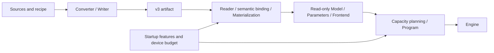
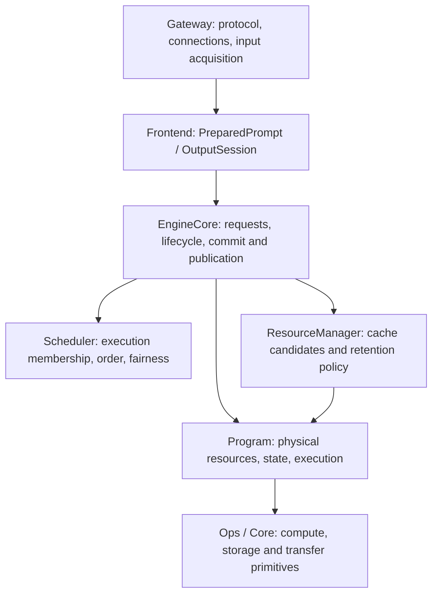
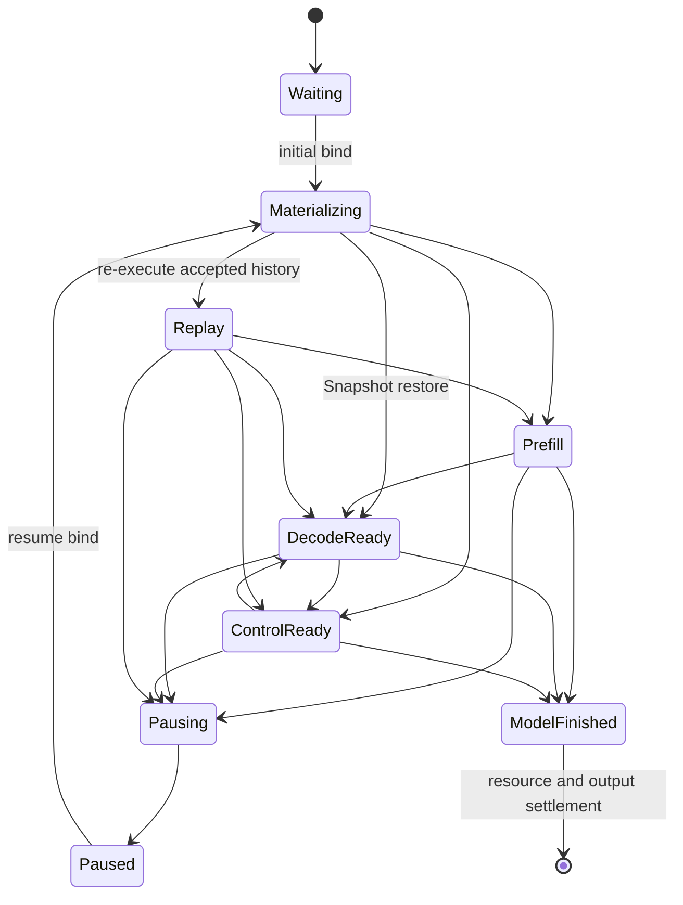

# Infernix Engine Architecture

This document defines model instances, execution ownership, the request lifecycle and the commit
relationships across modules.
[Resource scheduling and context cache](resource-scheduling-and-context-cache.md) defines the cache and
preemption policy; [Paged KV Context Store](paged-kv-cache.md) defines physical pages, replicas, the
address space and the consumer contract.

## 1. Product execution model

The Generation Engine uses one GPU, one resident model and a `max_concurrency=1..8` fixed at startup.
A bounded wait queue is ordered by submission; resident requests acquire resources incrementally per
finite execution unit and can be paused and resumed under resource pressure.
Each round, the decode-ready requests holding an execution permit form one compact batch, and prefill
and Replay chunks are interleaved.

Text, Vision, prefix reuse, MTP, DFlash/DFlash2, the CLI and HTTP serving all go through the public
`infernix::Engine`. A speculative backend is an execution path internal to the Program and shares request
scheduling, commit and result publication with ordinary decode.
The artifact must provide Text; startup independently selects Vision and either none or one spec
backend, and binds and prepares only the selected features and their shared dependencies.

An Engine's purpose is fixed at startup. CausalScoring is used for offline text scoring;
`CausalScoreCore` calls the Program serially, each window uses temporary State and Main KV, and it does
not enter the Generation Scheduler or the context cache.
Scoring-only staging is allocated only when CausalScoring starts.

### 1.1 Architecture, instance and weights

Model code owns the mathematical formulas, call order, component handoffs and state transitions. The
config provides instance parameters such as layer count, dimensions, the Attention/GDN distribution and
expert geometry. The architecture entry points are `Qwen3_5ForCausalLM` and
`Qwen3_5MoeForCausalLM`; training instances and physical weight assignments enter the corresponding
implementation as data.

A v3 artifact stores the config, physical objects, logical parameter Bindings, per-use-site Uses and
Frontend resources. The Converter handles source mapping, quantized or value-preserving import, fused
storage, packing and layout conversion; the loader validates, reads and uploads the raw bytes according
to the actual bindings. Swapping trained weights or combining existing representations with the same
architecture and a supported config reuses the same model code.



`metadata.name` provides the public instance name and defaults to the architecture name; serving can
override the public alias with `--model-id`. Execution is selected from the architecture, the config
and the actual bindings. The file contract is in the [container specification](artifact-container.md);
the numerical interpretation and planes of weights are in [numeric formats](tensor-formats.md) and
[storage layouts](storage-layouts.md).

## 2. Ownership and call boundaries



### 2.1 Gateway and Frontend

The Gateway owns protocol parsing, transport, media acquisition, the response schema and the connection
lifecycle. It converts product/protocol input into public owning input, calls the Engine, and reads
outputs and statistics.

The Frontend owns the tokenizer, chat template, Vision preprocessing, MRoPE prompt construction and the
owning `PreparedPrompt`; each request exclusively owns one `OutputSession`, which interprets stop,
the thinking/content channels, detokenization and model-private structured output. It also provides
output boundary semantics that can be reconstructed exactly from the template history.

The Frontend can preview the semantic effect of one model output; it is published only after the
Engine commits. Wait order and the physical cache are both owned by lower layers.

Compiled grammars for GBNF, JSON, JSON Schema, choice, regex and tool constraints are shared per
vocabulary in the Frontend; each request's OutputSession holds its matcher. The Engine compiles on
the submitting thread before queueing; the Program borrows the round's mask provider and passes the
masks to GPU sampling and speculative acceptance. The matcher previews and commits with the output,
and preemption and Replay keep its committed state. Timing and semantics are in the
[constrained decoding design](constrained-decoding.md).

### 2.2 EngineCore and Scheduler

EngineCore owns the request record, wait queue, resident slots, paused queue, cancellation, deadline,
response events and Engine availability. It orchestrates admission, resource transactions, finite
execution units and terminal settlement, and guarantees the ordering of model commits, output commits
and user-visible events.

The Scheduler owns execution membership and fairness rules: bounded bypass for fresh admission,
prefill rotation, compact decode/control batches, preemption victims and resume opportunities. It
decides using request state and submission order; paused requests wait locally for capacity events.

A lane is a resident request position; the StateImage slot, KV execution row and compact batch row
are independent identities. After a pause releases its lane, the request is still owned by EngineCore;
resuming can acquire a different lane.

### 2.3 ResourceManager

The ResourceManager owns private continuation owners and their restore points, the shared prefix
index, session hints, retention priority and optional save admission. It queries the Program for actual
checkpoint contents, transfer requirements and finite physical actions, selects a source, chooses
reclaim actions by restore loss, the current shortfall and evidence of real demand, and then adopts
the result returned by the Program.

The actual occupancy of State slots, Device pages, Host bytes, shared references and pins exists only
in the Program stores. The ResourceManager's index and retention records are not a second physical
ledger.

### 2.4 Model and Program

The Model owns the config, bindings, Uses, weight backing and read-only resources. A ModelInstance's
const Parameters borrow these resources, and planning and execution consume the same parameters.

Each Program exclusively owns:

- the active sequences, committed prefix identity, execution ledger and backend state;
- the StateImage, KV history, Device/Host replicas, leases and reservations;
- prefill, ordinary/speculative decode, forced control and Replay;
- provisional model state and accepted-prefix commit/rollback;
- workspace, CUDA Graphs and the fixed model calls.

The Program provides concrete state and physical feasibility to the runtime through native contracts.
Request order, cache value and output publication are decided by the runtime and the Frontend.

### 2.5 Instance lifecycle and fixed execution

The Binder resolves the logical requirements of the selected features from the architecture/config,
and the Materializer establishes stable backing and uploads the raw bytes.
A ModelInstance holds the Model, const Parameters, Frontend and Program. The Planner queries the
requirements of every layer and backend, resolves capacity against the Device headroom left after the
weights are resident, and establishes the final layout.

Weights, State/KV backing, block-table matrices, workspace and CUDA Graph resources are established
before requests are accepted. At runtime only ownership, mappings, frontiers and replica placement
change. Each Program exclusively owns its mutable state and Device allocations; on destruction, the
Engine worker and pending device work finish first, then the Program, Frontend, Parameters and Model
are destroyed.

Model code maintains the finite call forms, cross-Op fusion and phase relationships. For example, when
Q/K are one Q4 parent and gate/V are one Q5 parent, the Attention projection uses two weight
parameters; when a complete FP8/NVFP4 parent stores Q/K/gate/V, a single weight entry point is used.
A View keeps the parent's geometry, planes and element ranges; shared objects are resident once and
every use site keeps its own Use.
Activation permissions are `A16Only={A16}`, `AllowA8={A16,A8}` and `AllowA4={A16,A8,A4}`; a fused call
takes the intersection of the relevant permissions.

The reader, binder, native parameter preparation, capacity queries, warmup and execution each check
the contracts they consume. The executable scope is determined by the actual consumers. The
mathematical formula, the represented weight values and the implementation precision are interpreted
separately; numerical and state correctness of different quantization, batch, prefill or speculative
routes is verified against the [Op contract](op-development.md) and an independent oracle.

## 3. Request lifecycle



`Materializing` covers the source lease, any required transfers and destination installation; the
SequenceHandle is exposed only after the complete binding is adopted.
Capture is a temporary execution gate on a resident request; a request whose capture is incomplete
does not enter a model unit.
`ModelFinished` means the model has finished, but the Engine still holds the lane until finish/release
and the cache index update complete.
Cancellation and failure can enter a terminal state from the corresponding stable boundary.

### 3.1 Pause and resume

A pause is completed by the Program at a committed GPU boundary and returns an owning `ResumeState`:

- Snapshot keeps complete State/KV coverage that can be restored directly;
- Replay keeps the input, accepted ledger, RNG and backend control state needed to continue the
  request, and re-executes the missing history on resume.

The Engine keeps the same request record, OutputSession, generation budget and published results.
When Replay rebuilds physical state it does not republish historical output or consume the user's
generation budget again. A Snapshot is a reclaimable acceleration resource; after it is revoked the
request can still Replay.
A resume bind acquires a complete permit for "rebuild to the old frontier + the first real new unit",
and Native keeps the actual reservation across chunks.
At most one request is in this protected resume at a time; real new progress or a terminal state ends
the permit, after which other resumes are attempted.
Optional capture is skipped during this period; other requests that hold permits can still execute.

### 3.2 Outstanding capacity

After a successful submit, a request with nonzero output takes one outstanding slot, and a pause does
not return that slot. Release requires both:

```text
response_done       the worker has formed the final result or error
consumer_released   wait has finished, or the GenerationHandle was abandoned
```

The two can happen in either order; capacity is released exactly once. Abandoning a handle only sets
cancellation and `consumer_released`; the consumer thread does not call the Program.

### 3.3 Continuation and session

An active continuation is writable model state; a checkpoint is an immutable restore point. A complete
checkpoint aligns State, Main KV, the selected backend KV and the metadata needed to continue
execution. One private owner can hold multiple restore points that share KV history.

A session key provides a continuation lookup hint. Each request has a monotonic `publication_order`;
when an earlier-submitted request finishes later, it does not overwrite the session binding of a newer
result. The concrete restore point and shared publication rules are defined in the
[context cache](resource-scheduling-and-context-cache.md) document.

## 4. Worker, resources and execution

Only the Engine worker modifies request runtime state, the Scheduler, the ResourceManager and the
Program. Ingress, consumers and transport interact through queues, atomic cancellation flags and
response events.

A worker cycle first advances resource transactions, capture and terminal states and processes
cancellation, and on a capacity event tries a complete resume of the oldest paused request. It then
acquires unit permits row by row for resident requests (resumes first, then original ticket order),
uses the remaining headroom to try fresh admission, and then executes the runnable control and decode
work and one prefill/Replay chunk. A protected resume gets the chunk first; other prefills rotate among
resident requests, and decode batches use the actual `B`.

The Program's `reserve_units` atomically acquires the typed incremental demand of one call set; the
Engine calls it row by row to form the runnable subset. One row lacking resources does not stop other
permitted rows from executing. Ordinary unit settlement releases unused reservations and provisional
suffixes; a resume permit keeps the reservation still needed for the future rebuild and the first new
unit. Pressure can reclaim optional cache, revoke paused Snapshots or pause young resident requests;
admission and fairness details are in the core cache document.

A resource transaction can interleave with execution of unaffected resident requests, but the
Program freezes dependencies on the same sequence, source/destination lease, block table and transfer
buffer. Only one context resource transaction exists at any time, and the mappings accessed by any GPU
unit stay stable until it completes.

Admission checks start a bounded scan on events such as the wait queue, capacity release and resource
transaction completion. Ordinary decode progress by itself does not restart a failed admission scan. A
failed resume does not close fresh admission; while older resident requests remain, a paused request
does not blindly pause young borrowers to probe a resume. Ordinary active requests do not reserve the
whole remaining generation length.

## 5. Commit and publication

### 5.1 Context transactions

Bind, Capture, Demote and Pause use the same transaction driver:

```text
select the operation and source
  -> Program acquires the destination reservation and source lease
  -> stepwise transfers and completion checks
  -> publish the complete physical result
  -> Engine / ResourceManager adopt the result
```

The Program holds physical ownership during the transaction and returns the new sequence, restore
points, retired checkpoints, pause state and transfer observations. The source remains valid until the
required data has been copied and verified; abort cleans up reservations and transfers and does not
publish an incomplete destination. Reclaims or demotions that completed safely can be kept, and the
result must match the final actual occupancy.

### 5.2 Model unit transactions

Prefill finalization, decode and control can produce a move-only `PendingBatch` containing the frozen
sequence membership, provisional tokens, each row's produced extent and accepted-prefix execution
metadata.
The Engine forms each row's decision using the Frontend preview, then calls `Program::commit` or
`abort_pending` once. The Program commits or rolls back the corresponding Main/backend KV, recurrent
state, RNG and speculative state.

The recurrent fold of a speculative round is enqueued onto the Program stream inside commit and returns
without waiting for the device to finish: the decode, capture, transfer and prefill work that later
reads or writes that state is ordered after it on the same stream, and the host does not read the
fold's result. Only a terminal DFlash row that appends context through the pinned ingress synchronizes
inside commit, because the next round's submission overwrites that ingress.
A device error in the fold is reported as an execution failure at the next synchronization.

Non-cancelled rows satisfy:

```text
1 <= accepted_tokens <= produced_tokens
nonterminal -> accepted_tokens == produced_tokens
terminal    -> accepted_tokens may be a produced prefix
```

Cancelled rows use zero accepted tokens. The whole PendingBatch must be consumed; pending state cannot
be abandoned row by row.

### 5.3 Output order

```text
Frontend preview
  -> Program commits accepted model state and prefix execution provenance
  -> generation budget and scheduling accounting
  -> OutputSession commits the preview
  -> publish output events
```

The Frontend's boundary metadata describes only relative positions within the accepted span; the
Engine validates the range and carries it with the row. The Program converts it to absolute positions
from the base frontier and commits it atomically with the accepted tokens, State/KV and prefix digest.
When the Program commit fails, the OutputSession preview is not committed either.

Forced control uses the same commit mechanism; the tokens are provided by the Frontend, and it neither
calls the sampler nor advances the sampling RNG.
Once initial admission is established, `GenerationStart` is published once before any output delta; a
preemption resume does not publish it again.
The final response waits for terminal resources and cache owner settlement to complete.

## 6. Finish, cancellation and failure

On successful finish, the Program hands a retainable continuation to the ResourceManager or releases
the sequence; the ResourceManager updates the private owner, shared index and session, and then the
Engine releases the lane and completes the response.

Cancellation takes effect at a worker boundary: a Waiting request ends directly; a request that is
binding or transferring first settles/aborts its transaction; a resident request aborts after its GPU
unit is stable; a paused request releases its ResumeState and the related owners. Cancellation does
not rewrite in-flight mappings, and committed output is not rolled back.

Queue timeout, overload, input over limit and an unrepresentable request are request-level
rejections. Handle generation/owner errors, PendingBatch membership errors, a physical mutation that
cannot stably commit/abort, and broken integrity or adoption invariants fail the Engine. Cleanup first
ends pending context and model transactions, then releases resident/paused resources and the cache,
and finally completes every response. Internal state corruption must not be interpreted as a cache
miss.

## 7. Physical execution and CUDA Graphs

The startup planner establishes State/KV, workspace and Graph resources from the per-layer Parameters,
Uses and device capacity that execution itself uses. Mutually exclusive sequential scratch takes the
peak; data that lives across phases is kept until its last consumer: the Vision handoff is kept until
Text/the selected MTP finish consuming it, and speculative features and verify records are kept until
the commit boundary.

Growing KV uses shared typed paged pools, with physical pages separated from the logical token
frontier. All reservations, mapping updates, COW and replica publication complete at a stable GPU
boundary. Consumers receive only non-owning typed views.

CUDA Graphs are built per legal exact-`B` topology; page IDs, request identity and state selectors are
inputs, not graph keys. Ops own Graph update compatibility within their declared execution scope, and
the Program captures complete units and validates same-kind updates at startup.
A speculative unit runs as two Graphs, Forward and Finish: the CPU prepares the constraint masks
between them, overlapping the target forward, and both share one resource reservation and commit
boundary.
Length buckets bound the resource scope; the Program does not duplicate the dispatch boundaries of
the Attention Op's private kernels.

Source ordering uses the transfer and prefill costs corresponding to the hardware and actual bindings;
defaults are used for configurations without a matching measurement.
The actual reservations and stores determine physical feasibility.

Serve warmup uses the public Engine but disables the request-level context cache; afterwards it leaves
no continuation or checkpoint that external requests could hit.

## 8. Core invariants and implementation locations

1. The Engine worker is the only executor of request runtime state and physical mutation.
2. The Scheduler decides order, the ResourceManager decides logical retention, and the Program
   decides physical feasibility and state operations.
3. A unit acquires a complete permit before executing; a resume permit is kept across chunks until
   real new progress, and resources and mappings are stable during execution.
4. A checkpoint must correspond to complete State/KV coverage from one actual execution.
5. Pausing preserves request semantics and published output; resuming does not repeat output or
   generation accounting.
6. Output can be published only after its PendingBatch is fully consumed; a request keeps resource
   ownership until terminal settlement.
7. Every request, resource transaction and model transaction has exactly one terminal state.

| Responsibility | Main location |
|---|---|
| Public Engine facade | `include/infernix/engine.h`, `src/runtime/engine/engine.cpp` |
| Request lifecycle, scheduling and observation | `src/runtime/engine/engine_core.h`, `request_record.h`, `scheduler.h`, `engine_metrics.inl` |
| Instance construction | `src/runtime/engine/model_instance.*` |
| Cache owners, index and costs | `src/runtime/engine/context_cache/` |
| Public request, execution and resource contracts | `src/runtime/contract/` |
| Model config, binding and read-only data | `src/models/qwen3_5/config.*`, `load/`, `model.*` |
| Native parameters and fixed model calls | `src/models/qwen3_5/execution/` |
| Program planning, stores, context and model transactions | `src/models/qwen3_5/program/` |
| Frontend and model state layout | `src/models/qwen3_5/frontend/`, `state/` |
| Tensors, arenas, graphs, physical KV and raw transfers | `src/core/` |
| Generic artifact framing and materialization | `src/artifact/` |
| Closed compute and state-transition Ops | `src/ops/`, `include/infernix/ops/` |
| Input conversion, media acquisition and the HTTP Gateway | `src/product/`, `src/media/decode/`, `src/serve/` |
| Converter and Python container tools | `tools/convert/`, `tools/artifact/` |

The public C++ interface serves in-repository applications; Infernix does not install or export a C++
SDK. The v3 container (`.infernix`, or `.ninfer` from NInfer) is the only C++ product artifact; the
CLI, server and inference benchmarks all go through the public Engine, and the converter provides no Python model-inference path.
