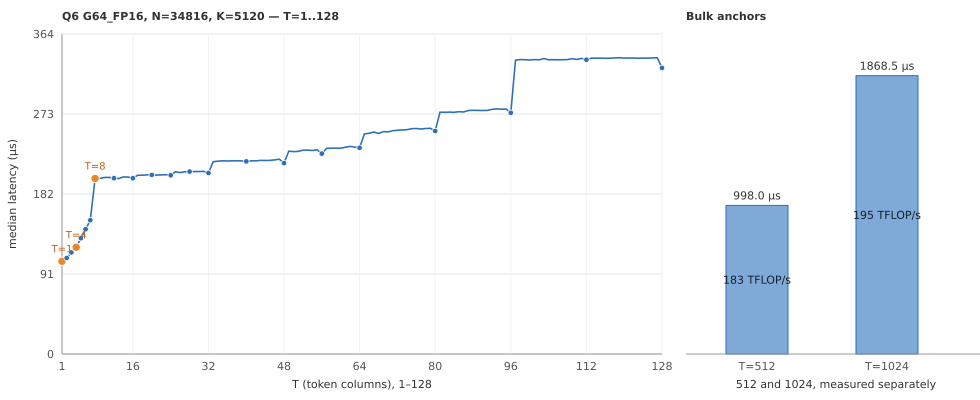

# Q6 Linear performance report: N=34816, K=5120

Measured 2026-09-19. This document records the complete Linear Op performance of
`text/layers/*/mlp/gate_up` with Q6 weights, as a reference for evaluating this shape and for further
tuning.

## Measured target and conditions

| Item | This measurement |
|---|---|
| Weights | `Q6_G64_FP16`, row-split layout; every 64 weights share one FP16 scale, plus a 16-byte high-bit plane |
| Mathematical shape | `W[34816,5120] × X[5120,T] → Y[34816,T]` |
| Input, output and policy | BF16 input, BF16 output, `A16Only` |
| GPU / toolchain | NVIDIA GeForce RTX 5090; CUDA 13.4, Release, `sm_120a` |
| Timing entry point | `infernix::ops::linear`; each CUDA Graph contains one complete Op call |
| Cache / sampling | 256 MiB L2 flush before each sample; 5 warmups, 50 measurements, median reported |
| Input fixture | The public bench's Q6 packed-weight and BF16 activation fixtures |
| Coverage | Every integer T=1–128; two large-T anchors at 512 and 1024 |
| Concurrent conditions | During measurement an idle resident Infernix service on the same machine held device memory; the bench flushed 256 MiB of L2 per sample |

Every currently measured call has exactly one Graph kernel node and zero external workspace. The
measurement scope is the pure Linear Op.

## Final latency curve



The left plot contains all 128 measured points; dots mark the key T values, with T=1, 4 and 8 highlighted
in orange.
The right plot shows 512 and 1024 separately. Lines in the plots connect only adjacent measured points.

## Logical bandwidth and Tensor Core utilization

The weights contain `34816 × 5120 / 64 × 50 = 139,264,000` bytes (32 bytes of low-bit codes + a 16-byte
high-bit plane + a 2-byte FP16 scale, per group of 64 weights). Following the
[Linear bench metric definitions](../linear-benchmark.md#5-mathematical-work-and-route-neutral-metrics):

```text
model_bytes = 139,264,000 + 2 × 5120 × T + 2 × 34816 × T
logical bandwidth GB/s = model_bytes / seconds / 1e9
bandwidth utilization = logical bandwidth / 1792 GB/s × 100%

effective compute TFLOP/s = 2 × 34816 × 5120 × T / seconds / 1e12
TC utilization = effective compute / 209.5 TFLOP/s × 100%
```

The denominators are the bench's fixed RTX 5090 specification constants. T=1 uses GEMV and its TC
utilization is shown as `—`; the final paths for T≥2 all use dense MMA with BF16 input and FP32
accumulation and use the corresponding **209.5 TFLOP/s** peak.
The current bench's Q6 rows do not fill the TC fields, so this document computes them with the formulas
above; no padding or extra tile work is added.

The "READ %" column is relative to the 1674.5 GB/s measured sustained-read limit the bench lists
separately.

| T | Latency µs | Logical bandwidth GB/s | Bandwidth utilization | READ % | Effective compute TFLOP/s | TC utilization |
|---:|---:|---:|---:|---:|---:|---:|
| 1 | 105.504 | 1320.7 | 73.70% | 78.87% | 3.38 | — |
| 2 | 109.280 | 1275.8 | 71.20% | 76.19% | 6.52 | 3.11% |
| 3 | 115.680 | 1205.9 | 67.30% | 72.02% | 9.25 | 4.41% |
| 4 | 121.472 | 1149.1 | 64.12% | 68.62% | 11.74 | 5.60% |
| 5 | 131.744 | 1060.1 | 59.16% | 63.31% | 13.53 | 6.46% |
| 6 | 142.048 | 983.8 | 54.90% | 58.75% | 15.06 | 7.19% |
| 7 | 152.224 | 918.5 | 51.26% | 54.85% | 16.39 | 7.83% |
| 8 | 199.712 | 700.5 | 39.09% | 41.83% | 14.28 | 6.82% |
| 12 | 200.096 | 700.8 | 39.11% | 41.85% | 21.38 | 10.21% |
| 16 | 200.032 | 702.6 | 39.21% | 41.96% | 28.52 | 13.61% |
| 20 | 203.808 | 691.1 | 38.57% | 41.27% | 34.99 | 16.70% |
| 24 | 203.424 | 694.0 | 38.73% | 41.45% | 42.06 | 20.08% |
| 28 | 207.584 | 681.7 | 38.04% | 40.71% | 48.09 | 22.95% |
| 32 | 206.048 | 688.3 | 38.41% | 41.10% | 55.37 | 26.43% |
| 40 | 219.168 | 650.0 | 36.27% | 38.82% | 65.07 | 31.06% |
| 48 | 217.216 | 658.8 | 36.76% | 39.34% | 78.78 | 37.60% |
| 56 | 228.096 | 630.2 | 35.17% | 37.63% | 87.53 | 41.78% |
| 64 | 234.624 | 615.4 | 34.34% | 36.75% | 97.25 | 46.42% |
| 80 | 253.792 | 573.9 | 32.03% | 34.27% | 112.38 | 53.64% |
| 96 | 274.496 | 535.3 | 29.87% | 31.97% | 124.69 | 59.52% |
| 112 | 334.976 | 442.4 | 24.69% | 26.42% | 119.20 | 56.90% |
| 128 | 325.600 | 459.1 | 25.62% | 27.42% | 140.15 | 66.90% |
| 512 | 997.984 | 180.5 | 10.07% | 10.78% | 182.91 | 87.31% |
| 1024 | 1868.510 | 118.3 | 6.60% | 7.07% | 195.38 | 93.26% |

## Curve interpretation and validation

The [shape implementation](../../../src/ops/linear/q6/shapes/n34816_k5120.cpp) chooses, by T, among SIMT
GEMV, `k128` small-block MMA and fixed-column-width MMA capacities:

- **T=1 is 105.504µs, 1320.7 GB/s, a nominal bandwidth utilization of 73.70%** (78.87% on the
  sustained-read basis). The 139.3 MB of weights make up all the traffic at this point.
- **T=1–7 use the SIMT path** (capacities 4, 5, 6, 7), and **from T=8 MMA is used**. T=7→8 is the largest
  adjacent step on this curve, with a `delta_pct` of +31.2%, from 152.224µs to 199.712µs. The SIMT segment
  adds about +10µs per column, while the MMA segment has a fixed weight cost of about 200µs; the two are
  organized differently, and the lower-latency single-token dedicated path is currently kept.
- **T=8–48 use `k128` small-block MMA**, with capacities 16, 24, 32 and 48. The curve is smooth across
  capacities, and every adjacent increase over T=16–48 is below 2%. This segment is
  **bandwidth-bound**: logical bandwidth 701..659 GB/s and nominal utilization 39.1..36.8%, clearly below
  the 73.7% at T=1.
  The latency in this range is almost independent of T (199.712µs at T=8, 217.216µs at T=48), showing
  that the fixed cost is reading the weights, which has not yet reached the read efficiency of the T=1
  path; this is a known limitation of the current implementation and was outside the scope of this
  dispatch tuning.
- **T=49–128 use fixed-column-width capacities**, the main difference of this shape relative to the
  registered vocabulary shape. The vocabulary shape (N=248320) keeps only one 128-column tile over the
  whole 49–128 range, whereas this shape's N is 7 times smaller and the `r64` tile has 544 row blocks
  instead of 3880. After partitioning by the candidate process of the tuning procedure:

| T | Vocabulary shape ladder | Final ladder of this shape | Change |
|---:|---:|---:|---:|
| 48 | 217.408 | 217.216 | -0.1% |
| 56 | 330.528 | 228.096 | -31.0% |
| 64 | 330.880 | 234.624 | -29.1% |
| 80 | 332.544 | 253.792 | -23.7% |
| 96 | 334.496 | 274.496 | -17.9% |
| 112 | 335.104 | 334.976 | -0.0% |
| 128 | 325.792 | 325.600 | -0.1% |

  Across all 128 measured points, the change relative to this baseline ranges from **-31.0% .. +0.7%**:
  the largest decrease is -31.0% (T=56), and the largest increase is +0.7% (T=25, within the fluctuation
  of repeated per-point measurement).
- **T=112 to 128 are not subdivided further**: T=112 is 334.976µs and T=128 is 325.600µs. The gain
  measured for candidates in the 97–128 range was below 1%, not worth adding another route.
- **Large-T anchors**: T=512 is **997.984µs, 182.91 TFLOP/s, TC utilization 87.31%**; T=1024 is
  **1868.510µs, 195.38 TFLOP/s, TC utilization 93.26%**.
  The two are measured separately so that an average cannot hide a regression in one of them.

`infernix_linear_q6_a16_test` passed. The new `N=34816, K=5120` case covers every boundary the ladder
distinguishes (1, 4, 5, 6, 7, 8, 9, 16, 17, 24, 25, 32, 33, 48, 49, 50, 128, 129), and compares against an
FP64 oracle over independently decoded packed codes and FP16 scales using the existing A16 error
criteria.
The test was rerun after every ladder change during tuning, and passed every time.

## Reproduction

```bash
cmake --build build -j --target infernix_linear_bench infernix_linear_q6_a16_test
./build/tests/infernix_linear_q6_a16_test

./build/bench/infernix_linear_bench \
  --qtype q6 --policy a16 --n 34816 --k 5120 \
  --sweep 1:128 --execution graph --warmup 5 --repeat 50 --flush-mib 256 \
  --csv-out profiles/bench/q6_n34816_k5120/final_t1_128.csv
./build/bench/infernix_linear_bench \
  --qtype q6 --policy a16 --n 34816 --k 5120 \
  --sweep 512:1024:512 --execution graph --warmup 5 --repeat 50 --flush-mib 256 \
  --csv-out profiles/bench/q6_n34816_k5120/final_bulk.csv
```

For further tuning, choose candidates, validate numerics and converge the dispatch according to the
[Linear tuning and reporting specification](../linear-tuning.md);
this report provides the measured results and curves of the final implementation and does not promise
that these capacities apply to other shapes.
