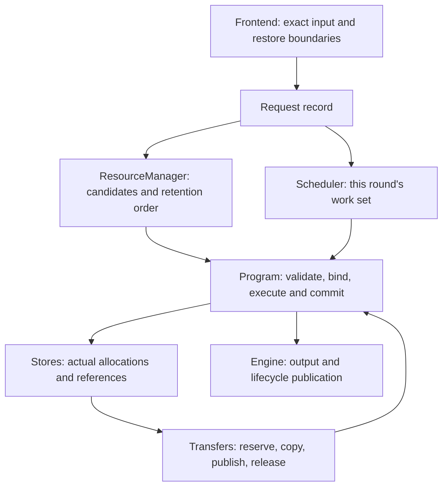
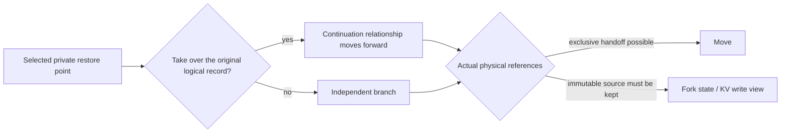

# NInfer Resource Scheduling and Context Cache

This document explains how Generation coordinates request execution, context reuse and preemption
recovery within limited device memory and Host RAM, and it is the design authority for these
policies. The global execution and publication relationships are in
[Engine architecture](engine-architecture.md); the physical KV layout, page tables and consumer
constraints are in [Paged KV](paged-kv-cache.md).

## 1. Core idea

NInfer runs on a single GPU with a single resident model and 1–8 execution slots fixed at startup.
For a Hybrid model to reuse a prefix, it needs the complete recurrent state at that position and
contiguous KV coverage. KV can be shared page by page, while recurrent state is a complete restore
image of one position. Cache management therefore uses three units at once:

- **Continuation records** manage the restore positions, named entries and real reuse eligibility of
  one history.
- **Checkpoints** express an exact restorable position, its StateImage and the KV coverage of each
  backend.
- **Physical objects and replicas** carry the actual occupancy, sharing, transfers and release.

Ordinary execution reserves resources incrementally for the next unit. When the working set grows
beyond what can be resident together, younger requests are paused and older requests advance first.
A resume separately acquires a complete permit covering the old frontier and the first new unit, and
returns the remainder only once new progress is made.
A request's committed history and output semantics are preserved across a pause; the device binding
can be rebuilt.

The cache primarily serves multi-turn conversations, agent tool round trips, input retries and shared
prefixes. Save opportunities come from input semantics and the request lifecycle; a prefill chunk only
splits scheduling work and does not save state automatically. Evidence of real adoption and repeated
computation determines heat; reclaim compares the actual restore loss against the currently scarce
resource among the finite physical actions Native offers.

<a id="ownership"></a>
## 2. Ownership and call relationships

| Part | Facts and decisions it owns |
|---|---|
| Frontend | Template rendering, token/position/media identity, typed rewrite and the actual input restore position, exact boundaries of shared markers |
| Engine request record | Original ticket, input and output objects, budget, cancellation, first-time stamps, continuation relationship across pauses |
| Scheduler | Execution membership, fresh scans and bounded bypass, prefill/replay rotation, preemption and resume gating |
| ResourceManager | Private continuations and public entries, prefix index, demand evidence, candidate ordering and cache admission |
| Native Program | Model ledger, backend frontiers, complete restore points, work-unit demand, state commit and restore |
| Stores inside the Program | Actual occupancy of State, KV, Host backing, references, reader leases, reservations and replicas |



The runtime queries the Program for actual occupancy and releasable amounts. Logical records can share
the same physical content, and dropping one record may release zero bytes. A checkpoint owner requires
its content to stay restorable; a reader lease protects the replica actually being read until the
computation or transfer completes. A cache record's retention tier does not mean the whole history is
pinned.

One Engine control thread advances policy, transactions and reference settlement. A Program owns its
own mutable state, workspace, context stores and CUDA Graphs and shares no mutable allocation with
other Programs.

<a id="capacity"></a>
## 3. Capacity and execution permits

### 3.1 Startup capacity

The Device prepares Main KV, the selected backend KV, StateImage, workspace and Graph space according to
the model's actual layout. A Main KV page is 64 tokens; the physical byte size of each KV kind is
determined by its layer count, geometry and storage format.

| Setting | Current meaning |
|---|---|
| `max_context` | The logical context limit of one request |
| `kv_capacity` | Token-equivalent capacity of the Main KV physical pool, rounded to pages; can also be solved automatically from the startup memory budget |
| `max_concurrency` | The limit C on simultaneously held execution bindings, range 1–8 |
| `context_cache.device_state_slots` | Extra slots beyond the C basic Device StateImages; defaults to C |
| `context_cache.host_capacity_bytes` | Pinned Host byte capacity shared by StateImage, Main/backend KV, pause snapshots and transfer destinations |

The page lower bound of the Main KV capacity curve is `max(ceil(max_context / 64), C)` and the upper
bound is `C × ceil(max_context / 64)`. The lower bound satisfies, respectively, one request
exclusively using the maximum context and the geometric requirement of C minimum pages. Native also
computes the layout of the selected backends, state, workspace and Graphs; explicit or automatic
capacity must fall within this curve and fit the available device memory. Capacity is not divided
evenly among lanes.

The default Host capacity is `8 GiB + 8 × the current model's Host StateImage size`. It is one shared
backing; the separate State and KV occupancy figures are for observation and must not be added up into
extra quotas. A transfer destination is charged from the moment it is reserved; publication only
changes its state and does not reduce occupancy. The allocator manages splitting of Host extents,
release on the last reference and coalescing.

Required request input, the token ledger, prepared media, Responses storage and the Frontend media
cache each have their own lifecycle and existing count, length or media budget limits. The Host context
capacity does not cover this memory and does not limit total process RAM.
Physical capacity also bounds the size of Native metadata; empty logical records and index branches
are deleted promptly.

### 3.2 Execution and resume permits

The Program computes the typed KV coverage of Prefill, Replay, Decode/Verify, Control or Normalize from
the actual binding state, including the speculative peak and backend needs. State, missing replicas
and tail-page COW are acquired separately at bind or capture time.
The requests to multiple typed pools for one unit succeed together; on failure the partial
reservation of this attempt is returned and the specific shortfall is reported.

The Engine acquires resident unit permits with resumes first and original ticket order first, forming
the runnable subset; one row temporarily lacking resources does not stop other permitted rows from
executing. Fresh admission uses the remaining headroom and cannot spend existing permits. Ordinary unit
settlement releases unused reservations, and later growth keeps requesting on demand. Operators do not
select cache victims internally.

When a synchronous reclaim has already changed capacity, the current permit is retried on the spot;
control returns to the scheduling cycle only when a transfer must complete first.

A pause resume acquires, at once, coverage for the complete State, missing KV, the tail page and
"rebuild to the old frontier + the first real new unit".
Native holds the real, not-yet-materialized reservation across Replay chunks; reaching the old
frontier or completing the bridge does not lift the protection. The resume permit ends only when a new
prefill commits, generation/control commits a new token, or the request enters a terminal state.

One request can temporarily hold most of the KV. If, after reclaiming optional cache and pausing other
requests, the only request still cannot acquire a legal unit, the Engine reports a capacity contract
error instead of waiting for a releaser that does not exist.

<a id="checkpoints"></a>
## 4. Continuation records and complete checkpoints

### 4.1 Private restore positions

A private record keeps one generation end point E, one input-side restore point and at most four
explicit private long anchors.

| Position | Purpose |
|---|---|
| E | The committed generation end point; serves continuations that include the previous turn's output |
| typed R: `ResponseReplay` | Before the current assistant response starts; expresses the rewrite upper bound for retries, structured tool calls and normalized history |
| typed R: `TurnClosure` | Before the first assistant start after the current real user; expresses the rewrite upper bound a new user turn imposes on an open turn |
| `recovery_frontier` | The input position whose State is actually kept; may equal R, or be an earlier content boundary from which the closing structure can be recomputed exactly |
| P | The raw/token input end point when there is no typed rewrite |
| Explicit private anchors | Other finite restore positions specified by the caller |

The Frontend chooses typed R from template rendering and a next-user probe, then independently decides
the actual restore position. For example:

```text
[user header][body] C [template closing structure] R [assistant generation header] P
```

Only when provenance proves that the C→R span immediately after a User/System/Developer message before
R is purely template closing structure, with no omitted content or media, and C maps to an exact token
frontier, is C actually saved; after a restore the closing tokens are recomputed. Otherwise R is saved.
This choice comes from the message structure corresponding to typed R and is independent of where this
request's automatic shared markers fall. Input planning and the source carry check use the same restore
position.

`rewrite_execution_frontiers` separately constrains how the mathematical execution is split, and can
lie after the assistant header. Moving the actual restore position earlier or a failed optional save
does not change these mathematical boundaries.

When restoring from a deeper E, Native carries input points that remain exactly compatible. When a
later position is needed, the old point can be retired before the new destination is requested; if the
new save fails, the old point is not restored. An earlier state cannot be derived backwards from a
deeper state. Each generation does not separately store a fixed P image; uses at the same position can
share physical state. An anchor at the same position is updated in place; beyond the limit the oldest
published point is replaced; if it cannot be replaced safely, this save is abandoned.

### 4.2 Integrity and identity

A checkpoint contains the exact input identity, the Native frontier, an immutable StateImage and the
required coverage of each typed KV.
The StateImage includes GDN/conv, the continuation hidden and the necessary local state of the selected
backend. The Main, MTP and DFlash frontiers are interpreted separately, and model code guarantees they
are compatible.

Ordinary generation usually has:

```text
execution_frontier = length of the computed KV/state
ledger_frontier    = execution_frontier + 1
ledger[execution_frontier] = the committed token waiting to be input next
```

An exact hit can enter sampling using the saved tail hidden. The MTP frontier−1 bridge, the DFlash
context append and the speculative accepted-prefix fold are completed by Native. An uncommitted suffix
does not become a restore point.

The prefix index's digest narrows the candidate set; before adoption, tokens, positions, media and
execution identity are still verified. State and KV obtained from independent recomputation cannot be
spliced together just because the tokens are the same; shared pages and cross-medium replicas keep
their real content identity.

### 4.3 Shared uses and automatic boundaries

A public shared entry is an independent entry point from which multiple requests can fork. When it
coincides with a private actual restore point, both logical uses are kept and the physical object is
shared by reference. The Frontend resolves at most four caller markers to exact frontiers, merges those
at the same point, and offers save opportunities in order. A shallower position can still serve a
suffix that changes later.

The product entry point chooses automatic markers, and the Frontend verifies their actual serialized
boundaries:

- OpenAI by default chooses the end of the last cacheable source part; a structured tool call uses its
  message boundary, and when there is no message content the tools boundary can be chosen. As the body
  keeps growing, the token prefix of earlier source parts can be reused as long as it still matches.
- An automatic hint is merged with an explicit marker at the same point; when all four explicit
  positions are used, the automatic hint gives way. An explicit message boundary is still interpreted at
  the position the caller specified and is not changed into a content boundary.
- Responses expands the stored history and normalizes this request's input before applying the policy;
  the original stored input does not carry newly added automatic markers.
- For other inputs that allow automatic structural positions, the Frontend can offer finite
  opportunities such as leading instructions and tools.

Source provenance, the tokenizer's exact frontier and the complete media range together determine
whether a position is valid. String appends can change the BPE tail token, so source-part positions
must still pass a real prefix match. Protocol parameters are in [Serving](../serving.md).

## 5. Saving and physical handoff

### 5.1 Save opportunities

Saves come from actual input restore points, explicit anchors, shared markers, normal generation end
points, and the execution snapshots that an actual preemption needs.
The end of a Prefill/Replay chunk does not by itself produce a save opportunity.

Before crossing a semantic frontier, the Engine calls Native to prepare the destination state, the
checkpoint descriptor and the necessary tail-page space. A private input point can first retire input
points of this record that are already obsolete, then try a Device slot, and use Host when capacity is
insufficient. Private input points share the original KV history and only add restore state and a
protected frontier; when a public entry needs an independent view, the necessary tail-page copy space
is acquired separately.

When one point has both a private and a shared use, the private point can still be kept if the shared
part does not fit. Capture is an optional cache write; reclaim must pass the admission check comparing
the new restore benefit with the content being replaced, and it does not preempt active requests. If no
suitable space exists, the save is skipped and necessary execution continues.
An existing compatible input point is carried directly; while a complete resume permit is in effect,
optional capture is skipped but necessary mathematical boundaries are still executed.

### 5.2 History, Move and Fork



A private record that is inactive and allows its entry to be updated can be taken over. If an
independent request already occupies that relationship, or the request crosses named entries, the
parent record is kept and a branch is created. Public aliases or physical readers determine whether a
Fork is needed; they do not require keeping an extra private parent record.

The E, input points and anchors of one history reference one KV directory, each with its own coverage.
Saving an internal input point does not copy the whole KV set, nor does it copy an extra tail page
because the point falls inside a partial page. When recomputing from an earlier input point, the deeper
private points it supersedes are retired first and then trimmed to the remaining protected range.
An independent branch or public view shares full pages and copies the partial tail page when needed,
keeping one writable history isolated from external immutable content.

Immutable state is kept separate from the active writer. An exclusively owned E is Moved directly; when
the source must be kept, a Fork can let the next computation perform the state transfer, while the
backend's necessary local copy still runs. When Device slots are tight and a Host replica exists, the
old identity's Host content can be kept and the Device slot handed to the new active identity; with only
a Device replica, D2H completes first. When saving and execution cannot both be satisfied, the optional
restore point may be abandoned; reader leases are always kept.

A normal finish freezes the legal execution state into a new E. Cancellation can make optional old
cache that this request took over disappear, while other independent owners remain valid. A session is
a lookup hint and a named entry; an older request finishing late cannot overwrite a newer
`publication_order`.
Unnamed history can still be reused by exact content.

<a id="sources"></a>
## 6. Source lookup and binding

An admission or Replay resume queries the private and public complete points on the hit path,
including the root. Native checks each one for an exact match, the maximum allowed frontier, carryable
private points and the physical handoff method.

Candidates are ordered by "restore transfer cost + remaining prefill cost". On a tie they are compared
by bytes moved, deeper reuse position, a legal session hint, private use, newer publication order and a
stable sequence number, in that order. Duplicate candidates with the same Native handle, the same
takeover method and the same carried points are merged; independently computed positions with the same
semantics are still handled separately.

The source cost model compares the current restore transfer with the remaining computation. Machine
transfer and artifact prefill calibration affect ordering but do not decide whether content is
restorable. Cache reclaim uses the actual lost restore coverage instead and does not estimate the
probability of future requests; the actual permit is requested by Native.

Only after a candidate is selected are the takeover prepared, the replaceable deeper private positions
retired and the destination space requested. One decision fixes the logical range it may reclaim; if
the candidate becomes invalid or resources are insufficient, it advances to the next candidate. Actual
reclaim results are not rolled back, and later attempts read the new facts. Binding installs the state
after preparation, transfers and dependencies complete, then reports the logical source adopted; the
ResourceManager records the use and takes over the record at this irreversible commit point. A
cancellation before that point does not produce a successful hit.

Fresh admission does not preempt resident requests for its own entry. Waiting must have a real
execution, transfer or release event; when no other resident work exists and no candidate can acquire
the first unit, the specific shortfall is reported. When resuming its own complete Snapshot, a request
redeems that snapshot first and does not proactively replace it with another cheaper source.

<a id="retention"></a>
## 7. Retention and reclaim

### 7.1 Real demand and two-tier retention

Private records and public entries each have an ordinary/reuse tier. A private owner stores the time of
real demand and the actually adopted position `proven_frontier` as a pair. Consume resets this pair from
this request's source; a Fork child takes this adoption's time and position. When a Fork starts from a
shallower position of the parent record, the parent keeps its original pair of evidence; the parent is
updated only when the source already covers the parent's proven position. Public use updates the public
entry independently. Completion, a plain save, moves and the request's own pause resume do not refresh
the evidence.

There is also a demand summary of at most 256 entries, recording the digest, frontier, identity tag and
actual request observations of a finite set of candidate positions. When a nonzero cross-request source
is adopted successfully, repeated demand is recorded for that exact adopted position; when a new
prefill **commits and crosses a candidate position**, computation demand is recorded, once per request
per position. Real computation by two different requests also proves repeated demand, so even if no
physical replica existed to hit before, a later capture can still gain reuse eligibility for that
position.
Rendering, candidate queries, polling, the request's own Snapshot/Replay resume and a plain save do not
produce observations; a summary hit only affects retention and admission, does not increase cache-hit
or reused-token statistics, and holds no State/KV. When an input restore point promotes the private
owner on the strength of this real repeated-demand evidence, the proven position is also set to that
input point.

The reuse tier is ordered by the most recent actual adoption or repeated-demand time, with 3/4 of each
physical pool's capacity as a soft target; older records are demoted.
Accounting uses the unique physical footprint; a single newest large record can exceed the soft
target. The tier determines reclaim order and does not promise permanent retention.

### 7.2 Finite physical actions

Native enumerates a finite set of demotion and deletion actions from the actual State/KV references;
each action carries its real set of holders, its releasable amount and the necessary transfers. All
optional holders of shared content must pass admission together; active/transfer readers separately
restrict whether it can be touched. Actions that release zero of the currently scarce resource do not
take part in the comparison.

One synchronous quote shares the history holders, physical page ownership and exact prefix
relationships, and migration and deletion candidates use the same set of facts.
The runtime uses each candidate's restore loss and retention eligibility for the admission checks and
ordering; permissions are checked separately, and the facts need not be recomputed.
This evaluation data acquires no resource references or reader leases, and becomes invalid once
resources or references change or control returns to the scheduling cycle.
A commit still checks the selected object's current complete holders, content version and pins before
acquiring the real reservation.

Private hot protection corresponds to its proven adoption position. When an earlier, exactly
compatible restore point that actually survives in the same owner still covers this position, a deeper,
not-yet-proven new suffix can be handled by ordinary marginal loss; an input point that is too shallow
cannot stand in for a deep position that was actually adopted.
An independent Shared hot owner still protects complete physical actions that involve it. Demotion and
deletion use the same protection test.

Each comparison uses the typed shortfall currently being handled; within the Device, State is handled
first, then Main/backend KV, and Host destinations are prechecked separately. Within this scarce unit
the runtime orders:

1. Ordinary content before reuse content.
2. Ordinary actions compare "marginal restore-token loss / release useful for this shortfall", with ties
   broken by retention order.
3. Reuse actions are ordered by most recent real demand time, older content first.

Deletion loss is computed from the real surviving fallback after the action. Nested E, input points
and Shared do not add up coverage of the same history twice; aliases deleted together cannot serve as
each other's fallback. A Device→Host demotion fixes the required Host victims before ordering, and the
complete action's net loss includes those deletions. It is zero-loss only when no complete restore
content needs to be deleted; it is not preferred merely because the Device source is preserved. Before
commit the same victim set is rechecked, and it is requoted if it changed.

When only a few pages are short, demotion picks a finite page group that satisfies the shortfall; State
and another typed pool are not all moved out just because they belong to the same history.
With a complete Host replica, the Device replica is released directly; otherwise a Host destination is
quoted and requested. Content and references are revalidated before the action starts, and the real
shortfall is queried again after it completes.

Within the same KV pool, migration groups selected in reclaim order can share one transaction. If all
the target Device pages an intermediate deletion candidate could actually release are already covered
by migrations selected earlier, it adds no capacity this time and this alternative can be skipped; the
test uses Native's complete physical page identity, not checkpoint names or nominal page counts. Other
deletion actions, and migrations that need Host victims, end the batch. The runtime checks the
permissions of each group and of the complete batch, and Native trims a strict prefix according to the
actual shortfall and Host headroom.
The commit happens only after all destination and source lease reservations succeed; Device pages that
already have a complete Host replica are released at commit, and the other pages are released after
the copy completes. The original candidate list is kept, so if the batch reservation fails, individual
migration and deletion alternatives can still be tried in turn.

### 7.3 Necessary execution and optional writes

Necessary execution can reclaim allowed optional content in the order above; its own source for this
step and in-flight readers are always kept. Optional capture and Host write-back that preserves existing
content hold only their own admission eligibility.

A new capture distinguishes repeated demand for the candidate's own exact position from the retention
heat the owner inherits. The former comes from real cross-request adoption of that candidate or
observations of repeated committed demand; when replacing the working set by repeated demand, the
candidate's own demand time is used and the owner's newer heat cannot be borrowed.

| Request and victim content | Admission condition |
|---|---|
| New capture without repeated demand of the candidate itself | The owner's retention tier bounds the replaceable range; the fixed added restore coverage benefit must exceed the cumulative deletion loss, and inherited heat does not exempt it from the budget |
| New capture with repeated demand of the candidate itself | Replaces ordinary or older reuse content using the candidate's actual demand time; working-set replacement is not limited by added coverage length |
| Host write-back of existing content | Admitted by the kept content's own eligibility and restore coverage benefit |
| Pause Snapshot | Optional cache first, then pause snapshots with a later ticket |

A new capture without repeated demand of the candidate itself fixes, when the decision starts, a budget
of added restore coverage relative to the surviving fallback.
Stepwise Host and Device deletions share the budget and accumulate the restore coverage already
sacrificed; the requester's benefit cannot be raised by deleting the fallback. Stepwise loss uses a
conservative accumulation and may give up a point that a more complex combination could have kept.

After admission, the private owner's overall retention heat can still inherit real adoption
eligibility; this does not grant a newly captured position that has not yet been repeatedly needed the
same replacement authority.

The Host victim set of a demotion satisfies the retention permissions of both the migration source and
the outer optional capture, and is bounded by the capture's remaining budget. Necessary execution that
needs Device space does not delegate its own permission to cold cache that is attempting to save. A save
without enough benefit or space is skipped and does not block necessary execution.

The Host first releases safe duplicate replicas, then performs a complete precheck on the finite
physical actions: deletion executes only if the actual released union is sufficient and all joint
holders can be replaced by this request. The nominal size of Shared references is not added up twice.
After the precheck, the allocator must still satisfy the complete StateImage and contiguous extent
geometry; an allocation failure can abandon the save, and completed deletions are not rolled back.

<a id="scheduling"></a>
## 8. Scheduling, preemption and resume

### 8.1 Ordinary cycle

Each cycle first processes transfers, terminal states and cancellation, and on a real capacity event
tries a complete resume of the oldest paused request. It then requests resident unit permits row by
row, resumes first and original ticket order first, keeps the runnable subset, and uses the remaining
headroom to try fresh admission.
It executes the permitted compact Control/Decode set and one Prefill/Replay chunk; rows committed by
Control reacquire Decode permits in the next cycle. Graphs use the actual member count and execution
profile.

The fresh queue keeps FIFO tickets, and each blocked request can be successfully bypassed by at most C
younger requests. Each scan checks the queue head and at most C following candidates; failed checks do
not consume the allowance, and an incomplete scan continues in ticket order. Queue or capacity changes
trigger a scan; ordinary decode does not keep redoing decisions that already failed. A paused request's
wait constrains only itself; idle lanes and capacity can serve fresh requests that are able to enter.

### 8.2 Pressure and complete resume

```text
unit shortfall → reclaim optional reservations and cache → revoke pause snapshots if needed
              → take back younger residents for the oldest necessary work, or pause a young row that cannot advance itself
```

Requests that are Materializing, already terminated or holding a complete resume permit are not
preemption victims. A pause happens at a stable Native commit boundary and does not interrupt a
kernel. Other permitted requests keep executing; the whole batch does not need to fit before running.

The paused queue tries resumes in original ticket order. While an older resident exists, a paused
request only tries idle and optional cache space; it cannot repeatedly pause young borrowers merely to
probe a resume. After the older resident leaves, the oldest paused request can take back the lane and
capacity held by younger requests. Fresh admission does not proactively preempt residents.

At most one request holds a complete resume permit at a time. It rebuilds its old history and completes
its first real new unit first, while other runnable units keep executing; optional capture is skipped
during the resume. Native holds the real capacity across chunks, and the runtime uses
`recovery_pending` to decide when protection ends. Reaching the old frontier, completing the MTP bridge
or simply reading back a Snapshot does not count as new progress; a new prefill, a generation/control
commit or a terminal state ends the protection.

Prefill chunk boundaries give resident requests a chance to rotate. When all lanes are occupied, a new
request still has to wait for some resident to finish, be cancelled or pause under resource pressure;
shortening chunks by itself does not let it enter earlier. A short request may therefore queue across
several chunks of a long request, and analyzing such latency requires checking lane admission and the
time of each execution unit separately.

The Engine advances context transactions in a bounded way at the start of the round, after admission
before execution selection, and after Control/Decode. Completed bindings promptly enter the existing
permit and semantic capture flow; after Control/Decode executes, only Prefill/Replay permits that have
not yet executed are refreshed, and each round is still one compact decode batch and one prefill turn.
Incomplete asynchronous events are not spin-waited on.

Events such as completion, cancellation, permanent shrink and a younger request pausing to release
resources provide resume opportunities. A failed resume waits locally for the next event; a request that
just paused does not resume immediately because of its own release. When no real execution or transfer
can release resources, the oldest request must advance through reclaim and a legal permit, and an error
is reported if the capacity contract is not met.

### 8.3 Snapshot and Replay

The request's input, output objects, budget, first-time stamps and continuation relationship persist;
Native's pause state keeps the committed ledger, frontier, sampling and backend resume information.
After the lane is returned, this information is still held by the request.

| Resume route | Content and work kept |
|---|---|
| Snapshot | The complete execution position and its State/KV references; execution resumes after reading back missing Device replicas |
| Replay | Keeps the committed ledger and input and releases the device execution state; recomputes to the pause frontier and then resumes the original phase |

Saving a Snapshot first completes the necessary backend normalization and copies only the unique
content missing for releasing the Device; immutable pages that other active requests are using can stay
shared. When resources for the save are insufficient, a destructive pause that adds no Device allocation
is used and converted to Replay; it does not recursively preempt another request to save one victim.

Pause snapshots can be revoked. Revocation releases the references of the whole execution snapshot and
switches to Replay; earlier input restore points and anchors still survive according to their own
integrity and cache rules. When an existing snapshot temporarily does not fit, it waits for a real
capacity event, and the snapshot is not proactively dropped just to reduce the resume volume.

Replay does not republish old output, does not charge the budget again and does not resample historical
tokens. Penalty counts are restored from committed output and actually counted forced control; the RNG
keeps its logical position, seed and purpose. Replay advances across chunks and does not increase
cross-request reuse heat.

MTP discards unused drafts and rebuilds them in a legal unit after the resume; DFlash/DFlash2 keep their
respective context and local state rules. Vision keeps prepared media, media identity and MRoPE, and a
stale vision handoff is re-encoded on demand.
These resume constraints use the same model mathematics implementation as ordinary execution.

<a id="transfers"></a>
## 9. Transfers and cancellation

A Program has at most one context transaction at a time, which can perform a bind, capture, demotion or
pause; work that already holds a permit and does not depend on that source can keep running. A
transaction follows:

```text
determine source and physical set → acquire source lease and destination reservation → submit copies
                                 → wait for completion events → publish replica/handoff → release releasable sources
```

An initial bind also acquires the first unit's permit; a pause resume bind acquires the complete resume
permit. A cancellation before DMA submission revokes this reservation; after submission, release waits
for the real readers to finish. The irreversible ownership handoff of a bind is separately bounded by
the adoption commit point. An incomplete replica cannot become a lookup source.
Owner/generation checks on sequences, checkpoints and pending handles prevent late completions from
misusing reused descriptors.
Device errors go to the Engine's unified failure cleanup; ordinary resource shortfalls return to the
policy layer.

A resume acquires the complete destination space, so the final resident distribution may fit while the
intermediate state of the swap does not. For example, with B on the GPU and A on the Host, the complete
destination for restoring A and the Host write-back target for B may compete for the same headroom.
With no other releaser, optional B can be dropped to make progress. Finite page-group reclaim reduces
excess movement but does not provide streamed, segmented resume.

<a id="examples"></a>
## 10. How the rules act along a request chain

| Scenario | Result from input to execution |
|---|---|
| An agent adopts the previous turn's E, then the client normalizes a tool call | Normal continuation Moves/Forks E; when deeper positions mismatch, the actual input restore point corresponding to typed R is adopted and the suffix recomputed |
| A private input restore point coincides with a public marker | One state can have both uses; the private record takes over and moves forward, and the public entry survives by its own references and heat |
| Prefixes α and α+β both have explicit markers, and a later request is α+γ | Each position gets a save opportunity; the shallower α can still serve as a complete source |
| A hot predecessor produces many one-off branches | Each branch carries its actual adoption time and completion does not heat it further; older records are demoted when the total footprint exceeds the soft target |
| A long input has no semantic save point | Execution opportunities are yielded per chunk and chunks do not save state; Snapshot or Replay is used only when pressure causes a pause |
| Only a few Main KV pages are short | Finite physical actions in that scarce unit are compared and the required page group is chosen; backend KV and State are not automatically all moved out |
| Host is zero and Device state is very small | Optional input-point/shared saves may fail; necessary execution reclaims space, and Replay advances under a complete resume permit |
| A long request is paused while an older resident exists | The long request waits locally; short requests that fit in the headroom keep entering, and after the older resident finishes it resumes in original ticket order |
| The same unretained candidate is recomputed by several requests | New commit observations form repeated-demand evidence, later saves can enter the reuse tier, and cache-hit statistics still count only actual reuse |

<a id="observability"></a>
## 11. Observability and performance limits

Logs and the [TTFT tool](../../tools/bench/ttft/README.md) report request results, hits and real work,
physical movement, preemption resumes and user-visible latency respectively. Initial prefill and
Replay are counted separately; cancellation counts only work already executed.
`GenerationStart` and the first admitted/first-token events are published only once, and a pause does
not recompute the ingress timeout.

The evaluation order is: first check whether a complete restore point that should exist was lost, then
look at severe regressions and in-stream stalls, and finally analyze the copy, recompute, CPU scheduling
and protocol preparation costs of individual scenarios. A complete hit may still need a lot of H2D; a
low TTFT may still come with an output gap after a long pause. Report the two separately.

Finite restore points cannot cover arbitrary history rewrites. Whole-record retention, competition from
new shared saves, fixed typed pools, complete resume destination space, Replay and Vision re-encoding
can all incur real costs. Throughput, TTFT, completion time and the maximum output gap together describe
the result; a single sample describes only that trajectory and establishes no latency distribution
guarantee.

Implementation entry points:

- [Scheduler](../../src/runtime/engine/scheduler.h), [ResourceManager](../../src/runtime/engine/context_cache/resource_manager.h): membership and policy.
- [EngineCore](../../src/runtime/engine/engine_core.h): transaction orchestration, lifecycle and publication.
- [Program](../../src/models/qwen3_5/program/program.h): model restore and resource operation contracts.
- [Native source organization](../../src/models/qwen3_5/program_sources.cmake): planning, stores, binding and the implementation of each transaction.
