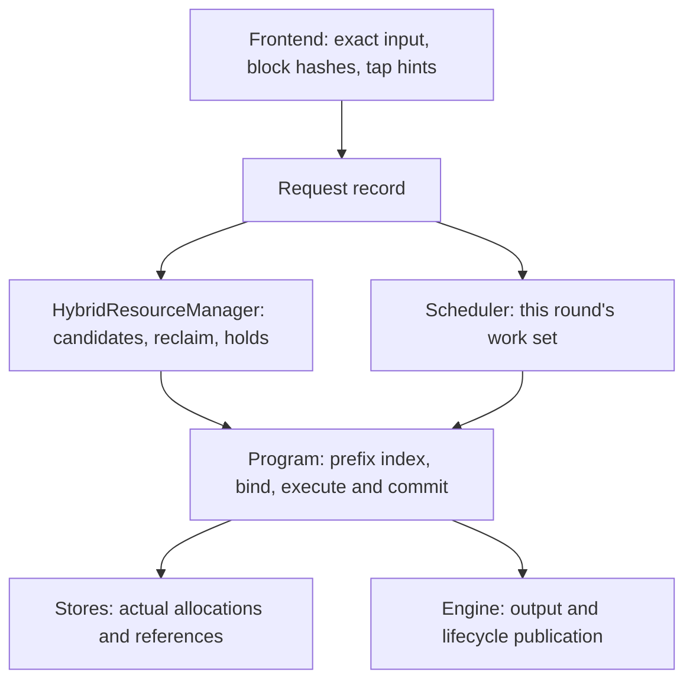

# Infernix Resource Scheduling and Context Cache

This document explains how Generation coordinates request execution, prefix reuse and preemption
recovery within limited device memory and Host RAM, and it is the design authority for these
policies. The prefix cache itself (block index, snapshots, taps, eviction, the Host slab pool) is
specified in the [Hybrid prefix cache](hybrid-prefix-cache-spec.md); the global execution and
publication relationships are in [Engine architecture](engine-architecture.md); the physical KV
layout, page tables and consumer constraints are in [Paged KV](paged-kv-cache.md).

## 1. Core idea

Infernix runs on a single GPU with a single resident model and 1–8 execution slots fixed at startup.
For a Hybrid model to reuse a prefix, it needs the complete recurrent state at that position and
contiguous KV coverage. KV can be shared page by page, while recurrent state is a complete image of
one position. The prefix cache therefore keeps content-addressed 64-token KV blocks in one radix
tree and sparse StateImage snapshots at chosen positions of it, on the Device and in a pinned Host
tier; an admitted request starts from the deepest snapshot its prompt reaches.

Ordinary execution reserves resources incrementally for the next unit. When the working set grows
beyond what can be resident together, cached blocks are evicted first; then younger requests are
paused and older requests advance first. A paused request gives up its lane and its device state
and later recovers by Replay, from the deepest state the cache then holds. A request's committed
history and output semantics are preserved across a pause; the device binding is rebuilt.

<a id="ownership"></a>
## 2. Ownership and call relationships

| Part | Facts and decisions it owns |
|---|---|
| Frontend | Template rendering, token/position/media identity, block hashes, tap hints at exact semantic boundaries |
| Engine request record | Original ticket, input and output objects, budget, cancellation, first-time stamps, pause and recovery state |
| Scheduler | Execution membership, fresh scans and bounded bypass, prefill/replay rotation, preemption and resume gating |
| `HybridResourceManager` | The Engine's connection to the Program's prefix index: admission candidates, reclaim by eviction, blocked-head prefetch, queue holds, cache statistics |
| Native Program | Model ledger and its execution splits, backend frontiers, work-unit demand, state commit, the prefix index and its retention policy |
| Stores inside the Program | Actual occupancy of State and KV, references, source pins, reservations and transfer destinations |



The runtime queries the Program for actual occupancy and releasable amounts. A cached block or
snapshot can be shared by many requests, and evicting one entry may release zero bytes. A source pin
protects a page while a fork or copy reads it.

One Engine control thread advances policy, transactions and reference settlement. A Program owns its
own mutable state, workspace, context stores and CUDA Graphs and shares no mutable allocation with
other Programs.

<a id="capacity"></a>
## 3. Capacity and execution permits

### 3.1 Startup capacity

The Device prepares Main KV, the selected backend KV, StateImage, workspace and Graph space according to
the model's actual layout. A Main KV page is 64 tokens; the physical byte size of each KV kind is
determined by its layer count, geometry and storage format.

| Setting | Current meaning |
|---|---|
| `max_context` | The logical context limit of one request |
| `kv_capacity` | Token-equivalent capacity of the Main KV physical pool, rounded to pages; can also be solved automatically from the startup memory budget, which then turns free VRAM into Device block cache |
| `max_concurrency` | The limit C on simultaneously held execution bindings, range 1–8 |
| `context_cache.hybrid.device_snapshot_slots` | Device StateImages beyond the C lane images, holding cached snapshots and tap staging |
| `context_cache.host_capacity_bytes` | The pinned Host slab pool shared by cached KV blocks and snapshot images |

The page lower bound of the Main KV capacity is `max(ceil(max_context / 64), C)`, which satisfies one
request exclusively using the maximum context and the geometric requirement of C minimum pages.
Without the prefix cache the upper bound is `C × ceil(max_context / 64)`; with it, pages beyond the
active leases are cache-only capacity. Native also computes the layout of the selected backends,
state, workspace and Graphs; explicit or automatic capacity must fit the available device memory.
Capacity is not divided evenly among lanes. The defaults of the cache settings are resolved at
Engine construction ([spec §14](hybrid-prefix-cache-spec.md#14-configuration)); with the cache
disabled both are 0.

Required request input, the token ledger, prepared media, Responses storage and the Frontend media
cache each have their own lifecycle and existing count, length or media budget limits. The Host slab
pool does not cover this memory and does not limit total process RAM.

### 3.2 Execution and resume permits

The Program computes the typed KV coverage of Prefill, Replay, Decode/Verify, Control or Normalize from
the actual binding state, including the speculative peak and backend needs. State and the private
copy of a cached partial tail page are acquired at bind time.
The requests to multiple typed pools for one unit succeed together; on failure the partial
reservation of this attempt is returned and the specific shortfall is reported.

The Engine acquires resident unit permits with resumes first and original ticket order first, forming
the runnable subset; one row temporarily lacking resources does not stop other permitted rows from
executing. Fresh admission uses the remaining headroom and cannot spend existing permits. Ordinary unit
settlement releases unused reservations, and later growth keeps requesting on demand. Operators do not
select cache victims internally.

A pause resume acquires, at once, coverage for the complete State and "rebuild to the old frontier +
the first real new unit". Native holds the real, not-yet-materialized reservation across Replay
chunks; reaching the old frontier or completing the bridge does not lift the protection. The resume
permit ends only when a new prefill commits, generation/control commits a new token, or the request
enters a terminal state.

One request can temporarily hold most of the KV. If, after evicting cached blocks and pausing other
requests, the only request still cannot acquire a legal unit, the Engine reports a capacity contract
error instead of waiting for a releaser that does not exist. The error names the request, the unit
kind and the KV pages still short. No part of the unit has run, so it is a
`RecoverableExecutionError` (engine architecture, failure handling): the residents fail with it and
the Engine keeps serving, unless a binding, materialization or paused request is in flight or the
Program cannot recover (Qwen3.5 has no recovery), when everything fails.

<a id="sources"></a>
## 4. Admission sources and binding

An admission or Replay resume asks the prefix index for its candidates: the deepest snapshot the
prompt reaches (a previous generation's endpoint or a prefill tap), and the root. The Program orders
them by "restore transfer cost + remaining prefill cost" with the Engine's context-cost
coefficients ([spec §6](hybrid-prefix-cache-spec.md)). Queries produce no use heat or cache hits.

A waiting request retains no source: queue holds only order eviction, and a request quotes the tree
again when it is next considered. A quote that went stale binds as an invalid source, so the Engine
moves to its next candidate. When a request shares a new prefix with a lane still prefilling, it can
wait for that lane's snapshot at the divergence instead of prefilling the prefix again.

A binding is one context transaction: it reserves the first unit's Device pages and the state slot,
shares the cached full pages by reference, copies a partial tail page and the snapshot into private
destinations, and restores Host-only blocks on the restore stream; the first prefill pass waits for
those copies layer by layer. After a successful binding no other source is tried.

<a id="scheduling"></a>
## 5. Scheduling, preemption and resume

### 5.1 Ordinary cycle

Each cycle first processes context transactions, terminal states and cancellation, and on a real
capacity event tries a complete resume of the oldest paused request. It then requests resident unit
permits row by row, resumes first and original ticket order first, keeps the runnable subset, and
uses the remaining headroom to try fresh admission.
It executes the permitted compact Control/Decode set and one Prefill/Replay chunk; rows committed by
Control reacquire Decode permits in the next cycle. Graphs use the actual member count and execution
profile.

The fresh queue keeps FIFO tickets, and each blocked request can be successfully bypassed by at most C
younger requests. Each scan checks the queue head and at most C following candidates; failed checks do
not consume the allowance, and an incomplete scan continues in ticket order. Queue changes, actual
capacity releases and completed transactions trigger a scan; a request that already failed under the
same event is not quoted again, and ordinary decode does not reopen a scan. While the FIFO head
waits, the Engine prefetches its Host-only path into spare Device cache. A paused request's wait
constrains only itself; idle lanes and capacity can serve fresh requests that are able to enter.

### 5.2 Pressure and complete resume

```text
unit shortfall → reclaim optional reservations and evict cached Device blocks
              → take back younger residents for the oldest necessary work, or pause a young row that cannot advance itself
```

Requests that are Materializing, already terminated or holding a complete resume permit are not
preemption victims. A pause happens at a stable Native commit boundary and does not interrupt a
kernel. Other permitted requests keep executing; the whole batch does not need to fit before running.

The paused queue tries resumes in original ticket order. While an older resident exists, a paused
request only tries idle and cache space; it cannot repeatedly pause young borrowers merely to
probe a resume. After the older resident leaves, the oldest paused request can take back the lane and
capacity held by younger requests. Fresh admission does not proactively preempt residents.

At most one request holds a complete resume permit at a time. It rebuilds its old history and completes
its first real new unit first, while other runnable units keep executing. Native holds the real
capacity across chunks, and the runtime uses `recovery_pending` to decide when protection ends.
Reaching the old frontier or completing the MTP bridge does not count as new progress; a new
prefill, a generation/control commit or a terminal state ends the protection.

Prefill chunk boundaries give resident requests a chance to rotate. When all lanes are occupied, a new
request still has to wait for some resident to finish, be cancelled or pause under resource pressure;
shortening chunks by itself does not let it enter earlier. A short request may therefore queue across
several chunks of a long request, and analyzing such latency requires checking lane admission and the
time of each execution unit separately.

The Engine advances context transactions in a bounded way at the start of the round, after admission
before execution selection, and after Control/Decode. Completed bindings promptly enter the existing
permit flow; after Control/Decode executes, only Prefill/Replay permits that have not yet executed are
refreshed, and each round is still one compact decode batch and one prefill turn. Incomplete
asynchronous events are not spin-waited on.

Events such as completion, cancellation, permanent shrink and a younger request pausing to release
resources provide resume opportunities. A failed resume waits locally for the next event; a request that
just paused does not resume immediately because of its own release. When no real execution or transfer
can release resources, the oldest request must advance through reclaim and a legal permit, and an error
is reported if the capacity contract is not met.

### 5.3 Replay

The request's input, output objects, budget and first-time stamps persist; Native's pause state keeps
the committed ledger, its execution splits, sampling and backend resume information. After the lane
is returned, this information is still held by the request. A pause releases the lane's device
execution state; the blocks and snapshots the lane already published stay in the cache.

The resume binds like an admission, from the deepest cached state on the request's committed
history (often its own prefix), then recomputes to the pause frontier and resumes the original phase.
Replay splits prefill at every split the ledger recorded, so its GDN decomposition and therefore its
state match the original execution exactly. A Qwen3.8-Flash-Next pause also publishes the lane's
state at its frontier to the cache, so its resume normally finds a snapshot at the paused frontier
itself and continues without recomputation (counted as a snapshot restore).

Replay does not republish old output, does not charge the budget again and does not resample historical
tokens. Penalty counts are restored from committed output and actually counted forced control; the RNG
keeps its logical position, seed and purpose. Replay advances across chunks and does not increase
cross-request reuse heat.

MTP discards unused drafts and rebuilds them in a legal unit after the resume; DFlash/DFlash2 keep their
respective context and local state rules. Vision keeps prepared media, media identity and MRoPE, and a
stale vision handoff is re-encoded on demand.
These resume constraints use the same model mathematics implementation as ordinary execution.

<a id="transfers"></a>
## 6. Context transactions and cancellation

A Program has at most one context transaction at a time, a bind or a pause; work that already holds a
permit and does not depend on that transaction keeps running. A bind follows:

```text
choose source → pin sources and reserve destinations → submit copies
              → wait for completion events → publish the lane's binding → unpin sources
```

An initial bind also acquires the first unit's permit; a pause resume bind acquires the complete resume
permit. A cancellation before the copies are submitted returns the reservations; after submission,
release waits for the real readers to finish. Owner/generation checks on sequences, snapshots and
pending handles prevent late completions from misusing reused descriptors.
Device errors go to the Engine's unified failure cleanup; ordinary resource shortfalls return to the
policy layer.

<a id="observability"></a>
## 7. Observability and performance limits

Logs and the [TTFT tool](../../tools/bench/ttft/README.md) report request results, hits and real work,
preemption resumes and user-visible latency respectively. Initial prefill and Replay are counted
separately; cancellation counts only work already executed. The `throughput` record's
`context_cache` object reports selections, state operations and occupancy, and its `hybrid` object
the cache's blocks, snapshots, taps, Host traffic and evictions.
`GenerationStart` and the first admitted/first-token events are published only once, and a pause does
not recompute the ingress timeout.

The evaluation order is: first check whether reuse that should exist was lost, then look at severe
regressions and in-stream stalls, and finally analyze the copy, recompute, CPU scheduling and protocol
preparation costs of individual scenarios. A complete hit may still need a lot of H2D; a low TTFT may
still come with an output gap after a long pause. Report the two separately.

Fixed typed pools, the complete resume permit, Replay and Vision re-encoding can all incur real
costs. Throughput, TTFT, completion time and the maximum output gap together describe the result; a
single sample describes only that trajectory and establishes no latency distribution guarantee.

Implementation entry points:

- [Scheduler](../../src/runtime/engine/scheduler.h), [HybridResourceManager](../../src/runtime/engine/context_cache/hybrid_resource_manager.h): membership and policy.
- [EngineCore](../../src/runtime/engine/engine_core.h): transaction orchestration, lifecycle and publication.
- [Program](../../src/models/qwen3_5/program/program.h): model restore and resource operation contracts.
- [Native source organization](../../src/models/qwen3_5/program_sources.cmake): planning, stores, binding, the prefix cache and the implementation of each transaction.
